# Windows 11 Enterprise Setup (Active Directory Integration)

After configuring the **Domain Controller** with **Active Directory**, **DHCP**, and **DNS**, I joined multiple **Linux** and **Windows** workstations to the domain. Windows 11 Enterprise simulates a realistic workplace setup. In enterprise environments, employees are assigned **Windows workstations** (typically running Enterprise or Pro editions) managed via **Active Directory**.

### 📝 Prerequisites

- **VirtualBox** is installed.
- A **Windows 11 Enterprise VM** is created with the ISO attached.
- **Windows Server 2025** is set up with **Active Directory Domain Services (AD DS)** enabled and running.

---

## 🖥️ Setup: Windows 11 Enterprise VM

## Installation Steps

1. Boot the VM using the Windows 11 ISO.
2. Select:
   - **Language/ Time and currency format** → **Next**
   - **Keyboard or input method** → **Next**
   - Check the license box → **Next**

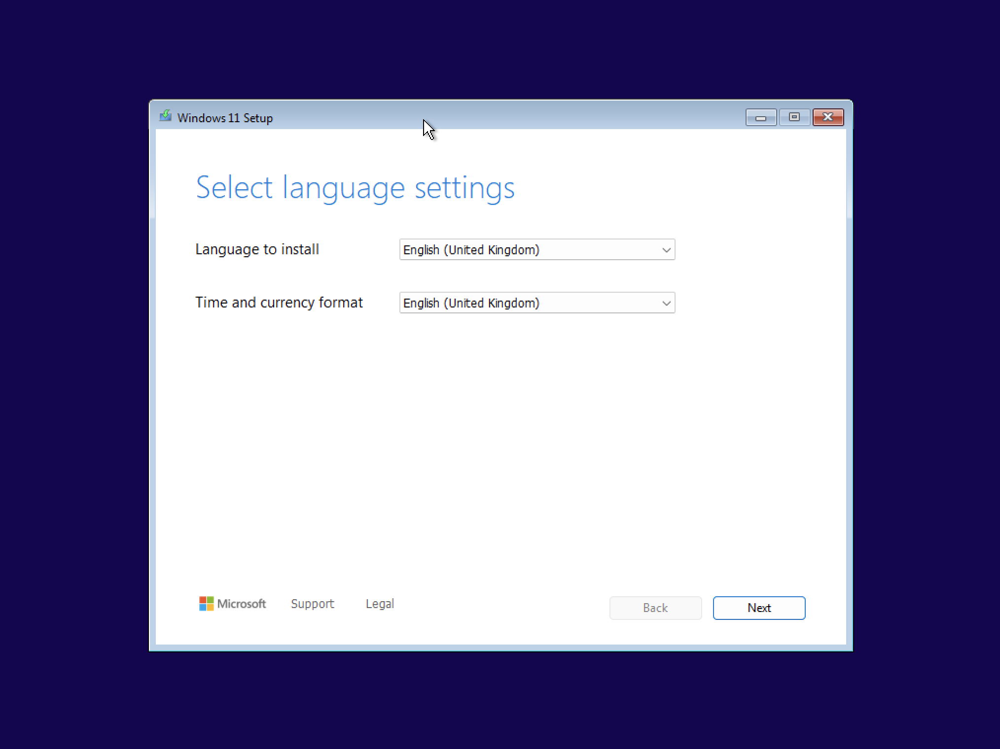

3. Select:
   - **Next** → **Install Windows 11**
   - Check the agreement box → **Next**
   - Check the license box → **Next**
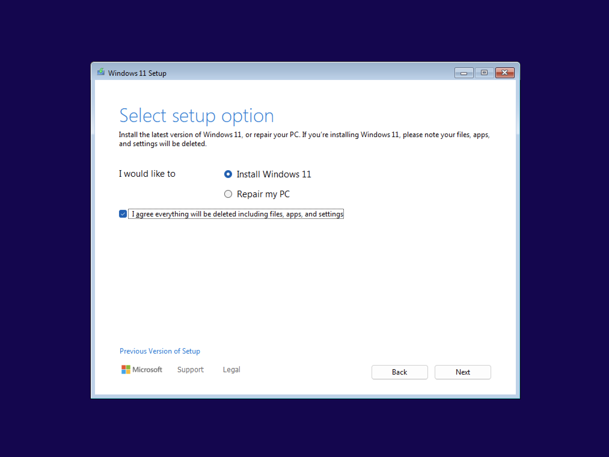

4. When prompted with disk options:
   - Select **Disk 0 Unallocated Space**
   - Click **Create Partition** → Accept default size → **Apply**
   - Wait until 2–3 partitions are created.
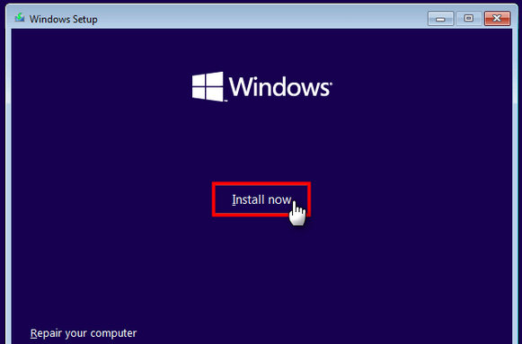

4. Select **Partition 3** (usually the largest) → Click **Install**.

5. Select:
   - **Next** → **Install Windows 11**   
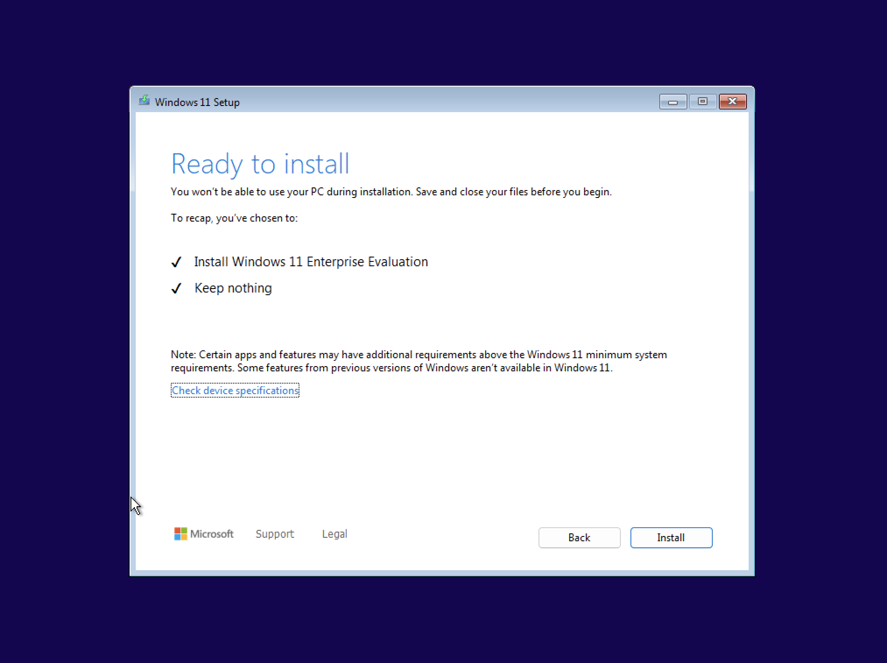
   
> 💡 **Why partitions?**  
> Partitions logically separate areas of a disk to better organise data and system files.

6. Wait for installation and automatic reboot.
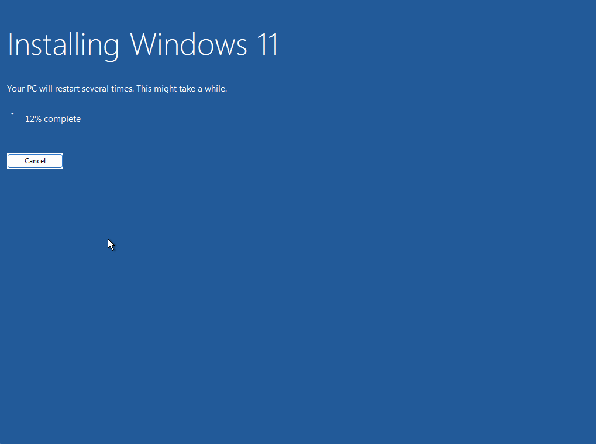

7. Follow the on-screen steps for region and keyboard setup.

## Create a Local Account

### Step 1: Microsoft Account Sign-In Screen
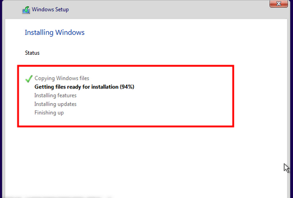

1. At the sign-in screen, open **Virtual Machine** → **Settings** → **Network Adapter**.  
2. Change the network configuration to **Private to my Mac** (this sets it as a *Host-Only Adapter*).  
3. Shut down the VM, then start it up again.  

### Step 2: Location and Network Setup
1. Go through the location and initial setup screens.  
2. On the *Network Connection* page, select **I don’t have internet** (or equivalent option).  

### Step 3: Create Local Account
1. Enter name as the hostname: `skynet-sec-work`  
   > Note: This will change once the workstation joins the domain. 
   
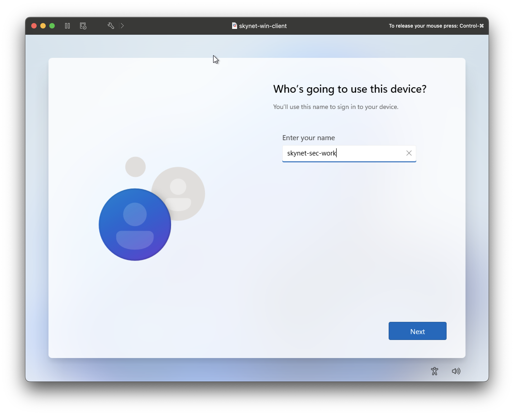 
2. Enter the password: `@password123!`  
3. Set up 3 security questions (answers don’t matter).  
4. Disable all privacy settings.  

✅ **Setup complete!**

---

# 🌐 Connect Windows 11 to Windows Server Domain

> 🛑 **Before You Begin**  
> Ensure the Windows Server 2025 (Domain Controller) VM is running.
> In the **Virtual Machine** settings, go to **Network Adapter** and change the connection back to **skynet-network** then restart the VM.

## Configure Static IP

1. Open **Control Panel** → **Network and Sharing Center**.

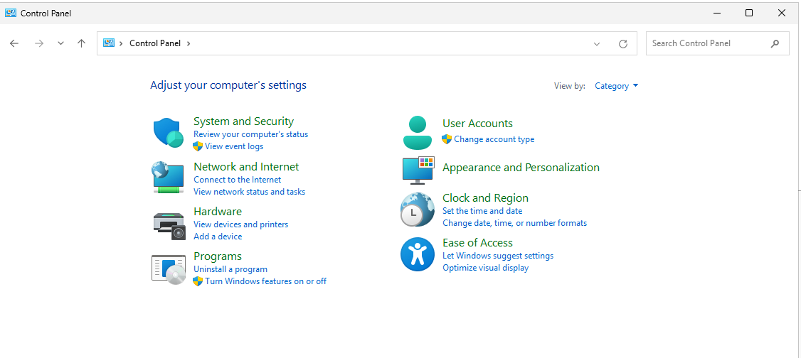
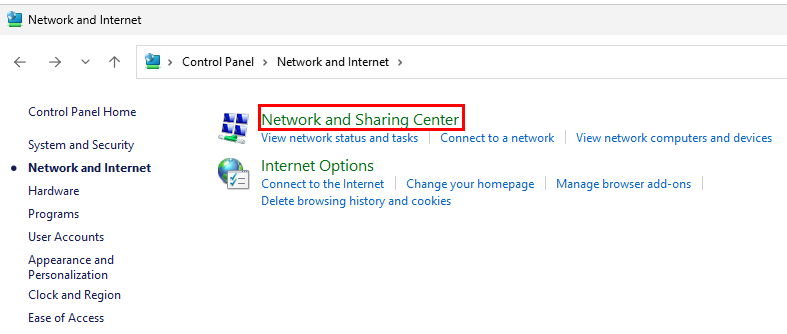

2. Click **Change adapter settings**.

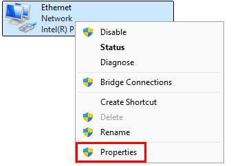

3. Right-click the `Ethernet` adapter → **Properties**.

4. Select **Internet Protocol Version 4 (TCP/IPv4)** → **Properties**.

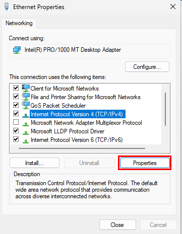

5. Set a static IP:

IP address: `10.0.0.100`
Subnet mask: `255.255.255.0`
Default gateway: `10.0.0.1`
Preferred DNS: `10.0.0.5`

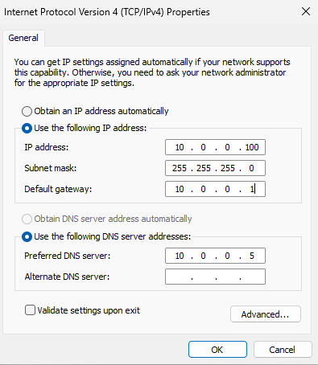

> 📌 Refer to the **Project Overview** for IP scheme details.

## Join the Domain

6. In the Start Menu, search **Change workgroup name**.
7. Click **Change**.

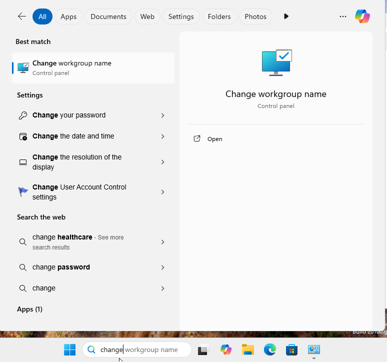
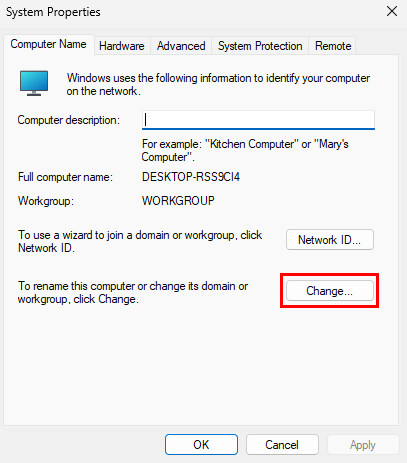

8. Enter:

Computer name: `skynet-win-client`
Domain: `corp.skynet-dc.com`

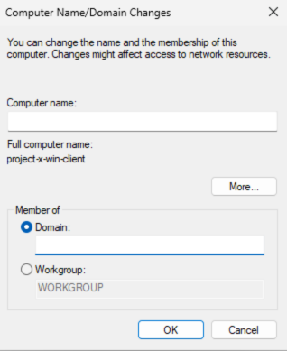

9. When prompted, enter credentials:

Username: `johnd@corp.skynet-dc.com`
Password: `@password123!`

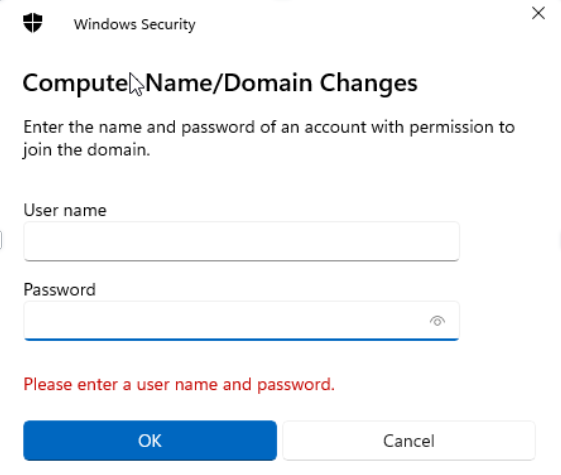

> 📌 See **Project Overview** for default credentials.

10. Accept the welcome message → Click **OK** → Reboot the VM.

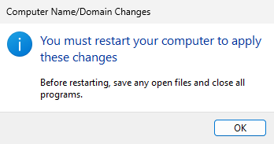

11. On login screen, select **Other User** → Log in with domain credentials.

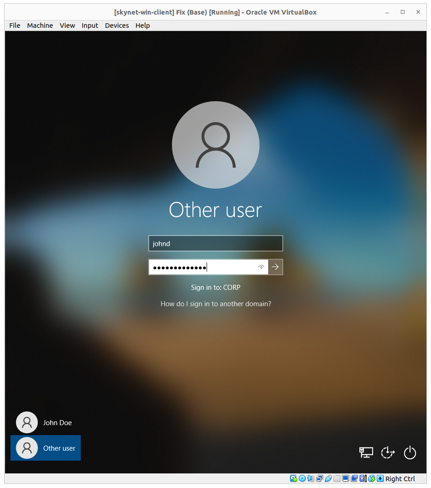

🎉 You're now connected to the Windows Domain!

📸 **Take a snapshot of the VM** for backup.

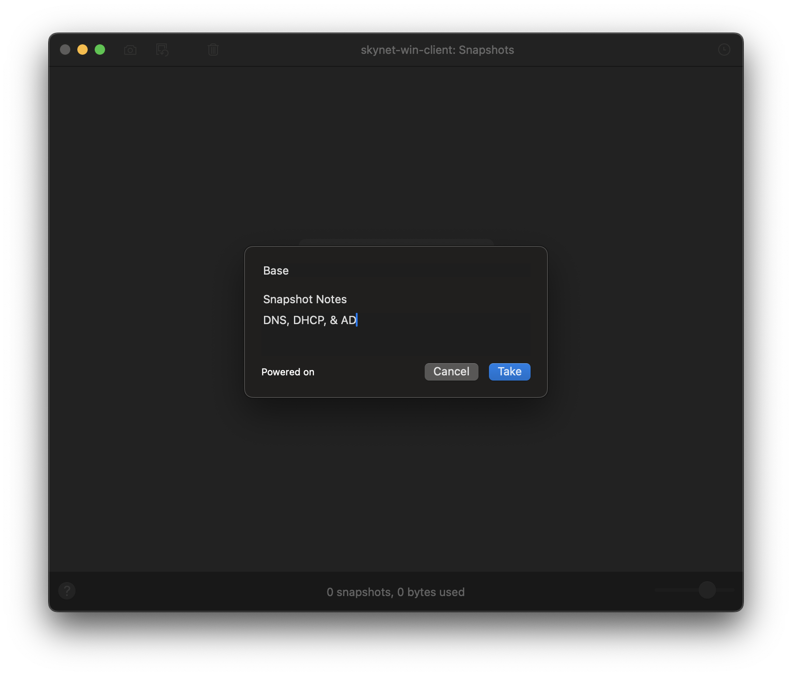
