# Ubuntu Desktop 22.04 Setup

## 📝 Prerequisites

- **VirtualBox** installed.
- A VM created with the **Ubuntu 22.04 ISO** attached.
- **Windows Server 2022** running with **Active Directory Domain Services (AD DS)** enabled.

---

## 🔍 Ubuntu Overview

### What is Linux?

**Linux** is an open-source operating system kernel that serves as the foundation for many distributions (distros) such as:
- Ubuntu
- Debian
- Fedora
- CentOS

It is widely known for its **flexibility**, **stability**, and **security**, and is used across servers, desktops, and embedded systems.

### What is Ubuntu?

**Ubuntu** is a user-friendly Linux distribution based on Debian, developed and maintained by **Canonical**. It is designed to be beginner-friendly while still powerful enough for enterprise use.

#### Key Features:
- **Open-Source** – Free to use, modify, and distribute.
- **Hardware Compatibility** – Supports a wide range of systems.
- **Active Community** – Regular updates and strong community support.

---

## 💻 Common Use Cases for Linux

### Servers & Hosting
- **Web Servers** – Run Apache, Nginx, MySQL, and more.
- **Cloud Platforms** – Powers infrastructure for AWS, Google Cloud, Azure.

### Development & Testing
- Built-in tools and package management with `APT`.
- Supports modern DevOps workflows: **Docker**, **Kubernetes**, **CI/CD**.

---

## 🔐 Security Implications

While Linux is generally considered more secure than many OSes, it's **not immune** to threats. Awareness and best practices are essential.

### Common Threats

- **Privilege Escalation**  
  Misconfigured `sudo` or excess permissions can lead to unauthorised root access.

- **Unpatched Vulnerabilities**  
  Not applying system updates can expose the system to kernel or app-level exploits.

- **Weak SSH Configurations**  
  Using default settings or weak credentials invites brute-force attacks.

- **Malware & Rootkits**  
  Though less common than on Windows, Linux-targeted malware does exist.

- **Supply Chain Attacks**  
  Malicious packages from untrusted sources can compromise the entire system.

---

# Setup Ubuntu

### 1. Install Ubuntu

- Hit `Enter` at the initial prompt.
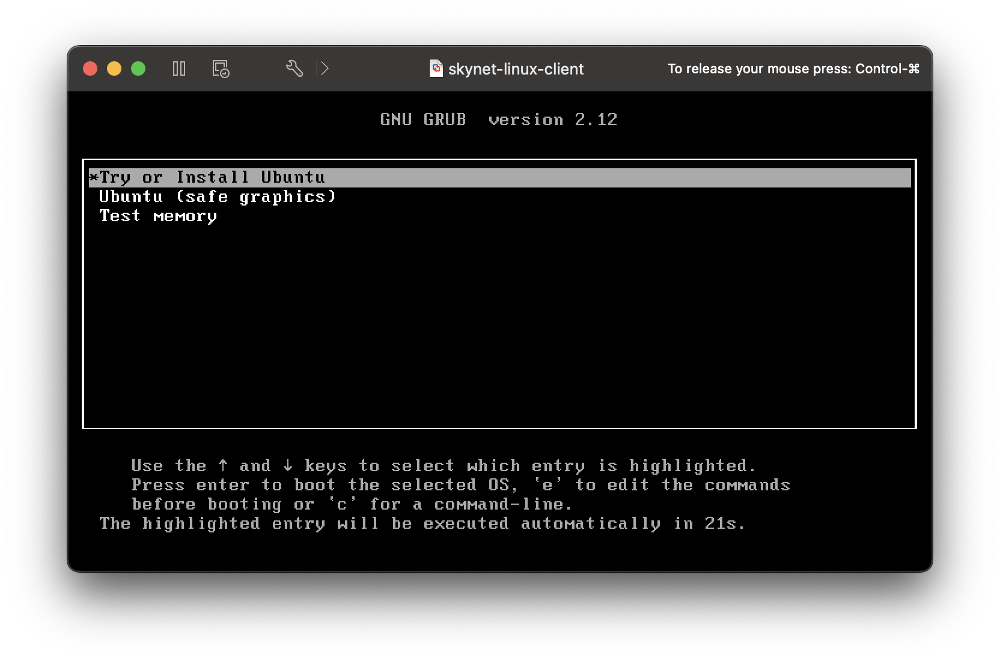
- Choose **Install Ubuntu**.

- Proceed through the keyboard layout options.
- For "Updates and other software", use the default settings.
- Select **Erase Disk and Install Ubuntu**, then click **Install Now**.
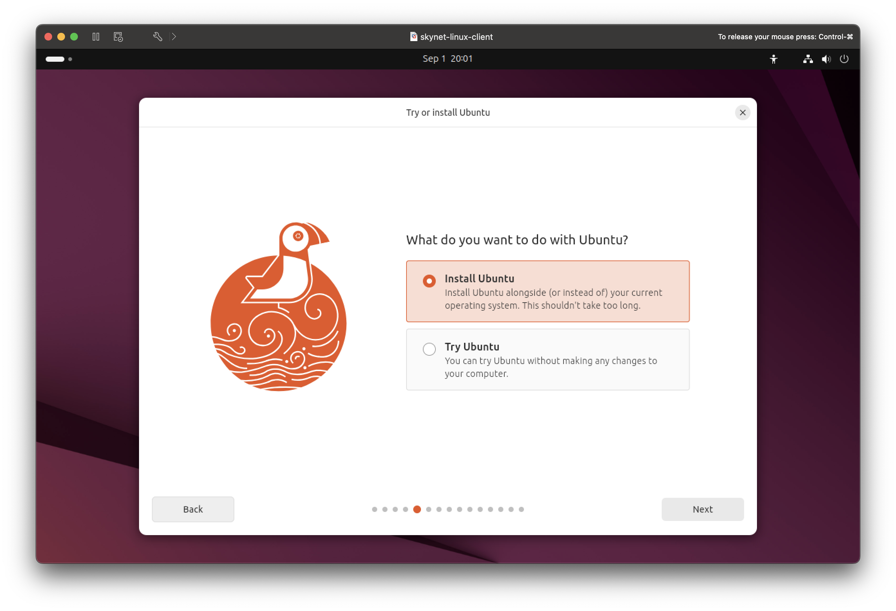
- Click **Continue**.
- Choose your region.
- Add your name, computer name, and username.  

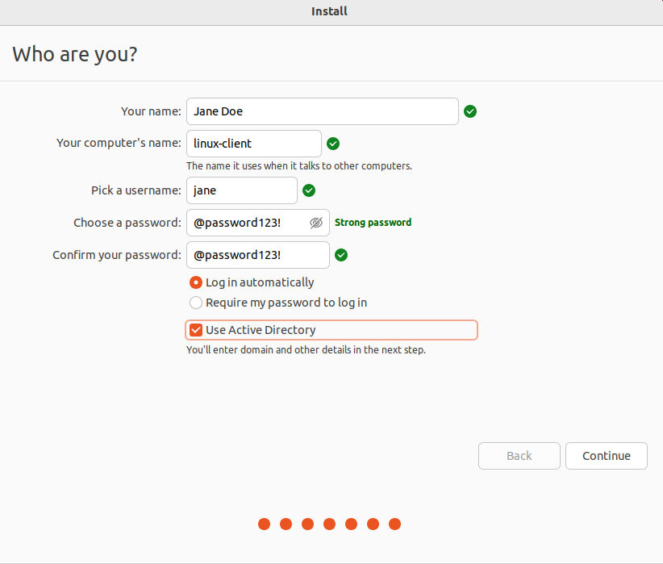

> 💡 **Note**: *Do not select "Use Active Directory" at this stage.*

Wait for installation to finish, let the VM restart, and press `Enter` when prompted to remove the installation medium.
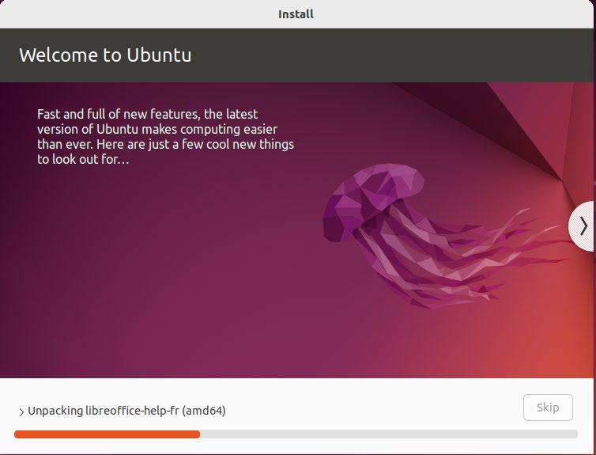

Go through the post-install wizard.  
Unselect **Location Services**.

Success!

---

### 2. Set Up Network

- Go to **Settings** → **Network**.
- Click **+** to add a new wired network.
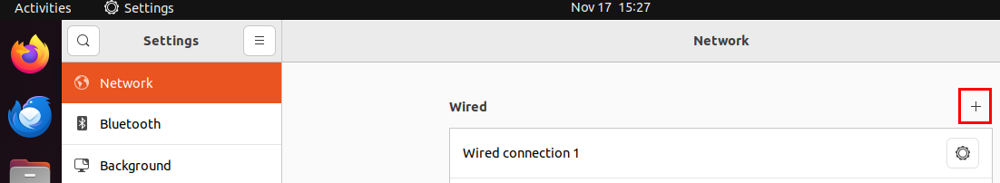
- Name it `Linux AD`, then go to the **IPv4** tab.
- Set a static IP and use the Domain Controller as the DNS.
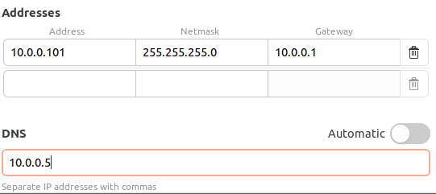
- Click the green **Add** button to save.

Ensure the Ubuntu VM can reach the Windows Server Domain Controller.  

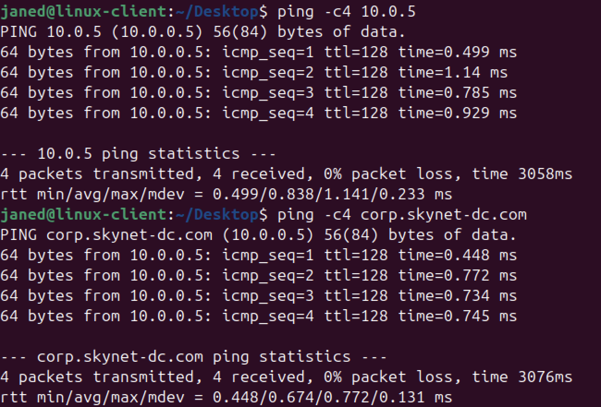

> 💡 **Note**: *You might not be able to ping `corp.skynet-dc.com` yet — that’s okay.*

📷 *Take Snapshot!*

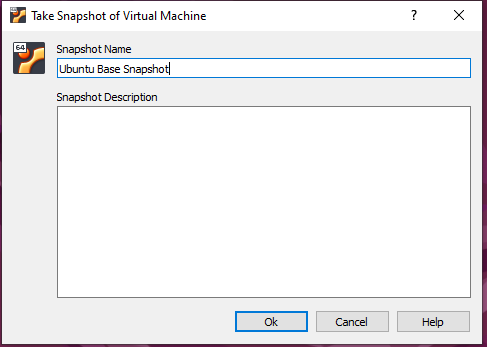

---

# Connect Ubuntu Desktop to Active Directory

Ubuntu is not native to the Microsoft ecosystem. You can connect it to AD using:

- **realmd + SSSD**
- **Samba Winbind**

> 💡 **Note**:❗*realmd/SSSD may not work with Windows Server 2022. Use Samba Winbind instead.*

---

## Samba Winbind

```bash
sudo apt update
sudo apt install -y winbind libpam-winbind libnss-winbind krb5-config samba-dsdb-modules samba-vfs-modules
```

During prompts, enter:

- `CORP.SKYNET-DC.COM` (uppercase)


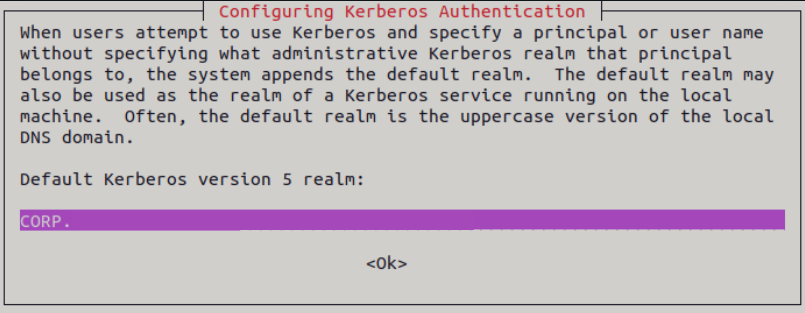

Backup and recreate config:

```bash
sudo mv /etc/samba/smb.conf /etc/samba/smb.conf.org
sudo nano /etc/samba/smb.conf
```

Add:

```
[global]
  kerberos method = secrets and keytab
  realm = CORP.SKYNET-DC.COM
  workgroup = CORP
  security = ads
  template shell = /bin/bash
  winbind enum groups = Yes
  winbind enum users = Yes
  winbind separator = +
  idmap config * : rangesize = 1000000
  idmap config * : range = 1000000-19999999
  idmap config * : backend = autorid
```

Edit name service switch:

```bash
sudo nano /etc/nsswitch.conf
```
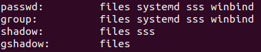

Add `winbind` to `passwd` and `group` lines.

Set home directory on login:

```bash
sudo pam-auth-update
```

Select: **Create home directory on login** → Tab → OK.

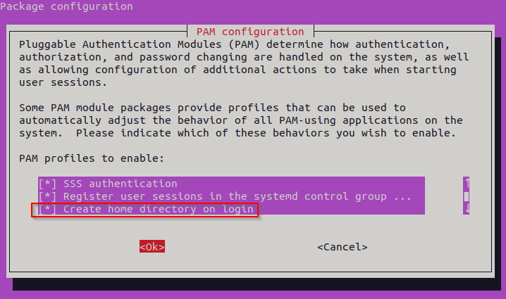

Set DNS:

```bash
sudo nano /etc/resolv.conf
```
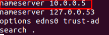

Join domain:

```bash
sudo net ads join -U Administrator
sudo systemctl restart winbind
```

Verify:

```bash
net ads info
wbinfo -u
```


---

## Add Jane’s AD Account

- Open **Server Manager** → **Tools** → **Active Directory Users and Computers**


- Go to **Users** → Right-click → **New** → **User**


- Username: `janed@corp.skynet-dc.com`
- Password: `@password123!`

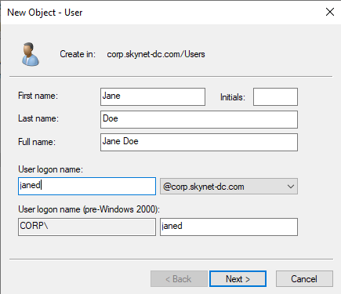
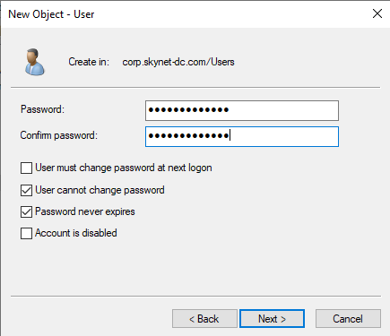

Restart and verify cache:

```bash
sudo systemctl restart winbind
wbinfo -u
```
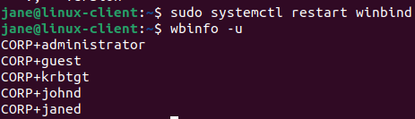

Login as Jane:

```bash
sudo login
```
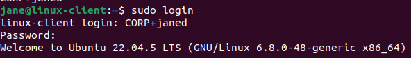

Then check ID:

```bash
id
```
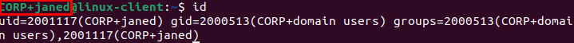

Success! `LINUX-CLIENT` should appear under **Computers** in AD.

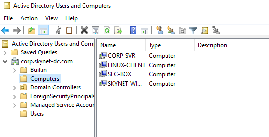

📷 **Take another Snapshot!**


