# Security Onion Setup

## 📝 Prerequisites

- **VirtualBox** or **VMware Workstation Pro** installed.
- A VM created with the **Security Onion ISO** attached.
- At least **50 GB of dynamic storage** allocated to the VM.
- **Windows Server 2022** is running with **Active Directory Domain Services (AD DS)** enabled.
- 
---

## 🔍 Security Onion Overview

### What is Security Onion?

**Security Onion** is a free, open-source platform for:
- **Network Security Monitoring (NSM)**
- **Log Management**
- **Intrusion Detection & Response**

Think of it as the **Kali Linux** of network monitoring—preloaded with powerful tools:

- **Zeek (formerly Bro)** – Network traffic analysis.
- **Suricata** – Intrusion detection and prevention.
- **Elastic Stack** – Log management and analysis via Elasticsearch, Logstash, and Kibana.

---

### 🔧 How It's Used

#### 📡 Network Security Monitoring (NSM)
- **Packet Capture & Analysis** – Zeek inspects traffic for anomalies or threats.
- **Intrusion Detection** – Suricata provides real-time deep packet inspection.

#### 🗃️ Log Management
- **Log Collection & Aggregation** – Gathers data from endpoints, firewalls, and servers.
- **Elastic Stack Dashboards** – Visualizes and analyzes logs via Kibana.

#### 🛡️ Incident Response
- **Alerts & Correlation** – Flags suspicious activity for analyst review.
- **Threat Hunting** – Enables proactive search for compromises using enriched data.

---

## 🔐 Security Implications

Security Onion strengthens an organization's cybersecurity posture by providing:

- **Proactive Threat Detection** – Identifies and flags malicious behavior early.
- **Full Network Visibility** – Correlates data from multiple sources for comprehensive insights.
- **Incident Response Tools** – Equips analysts with data to investigate and respond to threats quickly.

> 💡 **Best Practice:**  
> Always keep Security Onion **isolated from production networks** to reduce risk of compromise.

---

# 🛡️ Setup Security Onion

## Step 1: Begin Installation

Navigate to **Install Security Onion 2.4.110 Desktop** and press `Enter`.
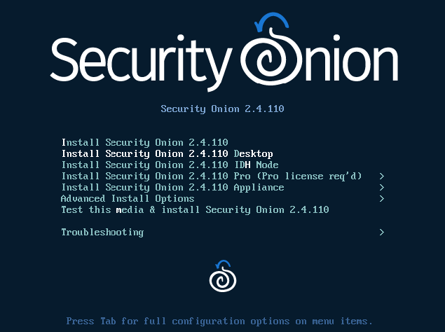

## Step 2: Accept Installation

Type `Yes` and press `Enter`.

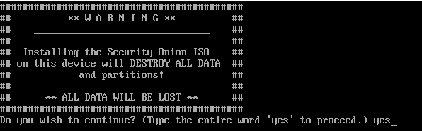

## Step 3: Create Administrator Account

Use the following credentials:

```
Username: skynet-sec-work
Password: @password123!
```
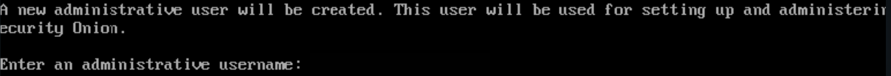

> 💡 **Note**:👉 Refer to the “Project Overview” guide for default usernames and passwords.

## Step 4: Wait for Installation

Let the system install (this may take a few minutes). Once completed, press `Enter`.
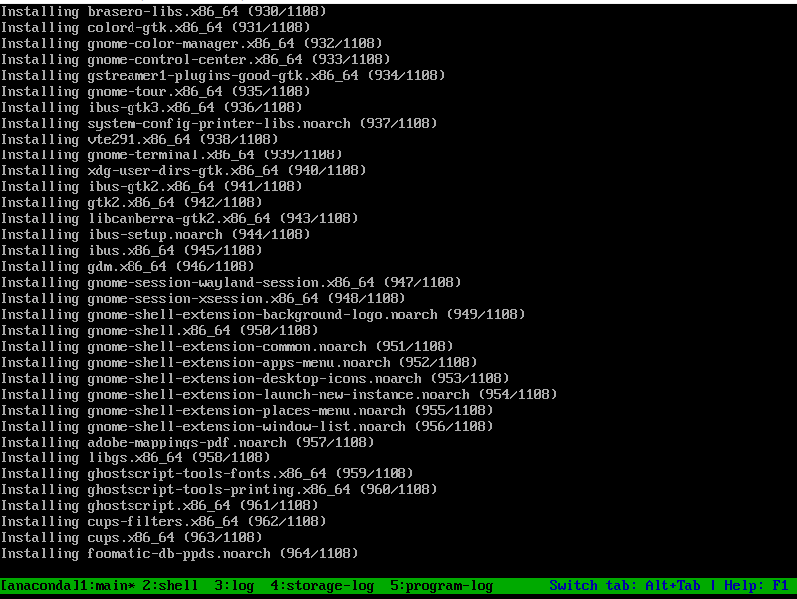

## Step 5: Log In

Let the VM reboot, enter the following credentials and select “Yes” when prompted.:

```
Username: skynet-sec-work
Password: @password123!
```

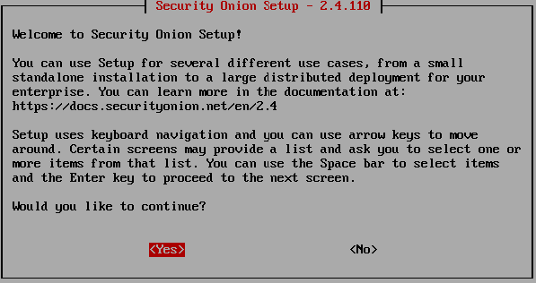

## Step 6: Setup Hostname

When prompted, enter the hostname:

```
skynet-sec-work
```


## Step 7: Configure IP Address

At the IPv4 address setup, enter:

```
IP Address: 10.0.0.103/24
Default Gateway: 10.0.0.1
```
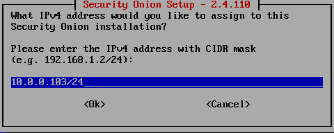
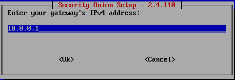

Accept the default DNS servers.

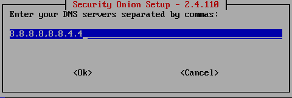

## Step 8: Add DNS Entry

Add this DNS entry when prompted:

```
corp.skynet-dc.com
```
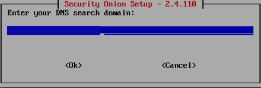

## Step 9: Finalize Setup

When prompted, select the default **No**, then press `Enter`.


Use the Left Arrow Key to select **Yes**, then press `Enter`.


The graphical menu will close and return to the terminal.

Restart the machine:

```bash
reboot
```

## Step 10: Log In to Security Onion

Once rebooted, log in with the account created.

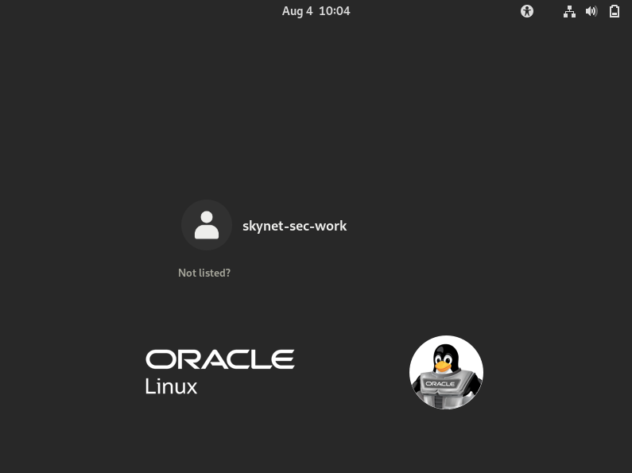

## Step 11: Open Terminal

Right-click the desktop and choose **Open in Terminal**.


## Step 12: Set Root Password

Change the root password to `@password123!`:

```bash
sudo passwd root
```
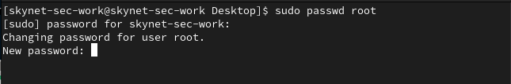

✅ **Setup Complete!**


📷 **Take a snapshot to preserve the configuration.**

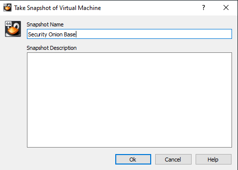


