# Setup The Attacker Machine

## Prerequisites

- VirtualBox or VMware Workstation Pro Installed.
- Virtual Machine with Kali Linux ISO has been downloaded and provisioned (the ISO should be attached to the new VM).

## 🐉 Kali Linux Overview

### What is Kali Linux?

Kali Linux is a specialized Linux distribution tailored for cybersecurity professionals and ethical hackers.

Developed by Offensive Security, it is a Debian-based operating system preloaded with tools designed for penetration testing, ethical hacking, and digital forensics. Kali Linux is widely used for assessing system vulnerabilities, testing network security, and investigating cyber incidents.

Kali comes with a suite of security tools to assist in the operations.

### How is Kali Linux Used?

Kali Linux serves multiple purposes in the cybersecurity field, including:

- **Penetration Testing**: Professionals use Kali Linux to simulate real-world cyberattacks and identify vulnerabilities in systems, networks, and applications. Tools like Metasploit and Burp Suite are often employed in these scenarios.
- **Vulnerability Assessment**: It provides tools to scan and identify weaknesses in infrastructure, ensuring they are addressed before exploitation.
- **Cybersecurity Training**: Kali Linux is widely used in cybersecurity training programs, competitions, and certifications.

### Security Implications

**Benefits**

- Can be used by trained professionals to help understand their organizational security controls and identify vulnerabilities before actors can exploit them.
- Offers a platform to safely practice offensive security techniques in controlled environments.
- Tools are aggregated in one centralized ecosystem.

**Risks**

- This tool can also be used maliciously by attackers if accessed by unauthorized individuals.
- Kali Linux is not meant to be a production environment without isolation. Be careful.

## ⚙️ Configure Kali Linux

1. Choose the default “Graphical install”.

2. Choose Language ➔ “Continue”.

3. Choose the Country and Keyboard layout.
4. Change the hostname from `kali` to `attacker` ➔ “Continue”.  

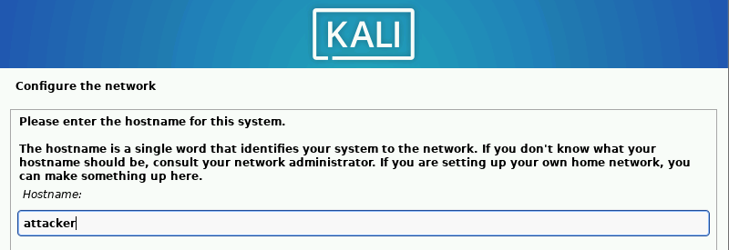

5. Leave the domain name empty ➔ “Continue”.

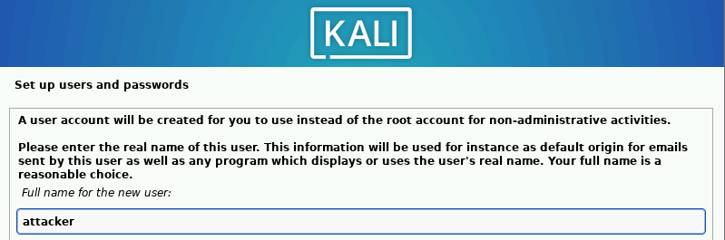

> 💡 **Note:** Refer to the “Project Overview” guide for more information on default usernames and passwords.

6. Add `attacker` as the new user and username.

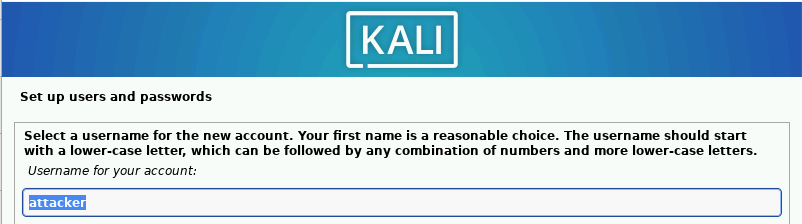

7. Enter `attacker` as the default password ➔ “Continue”.

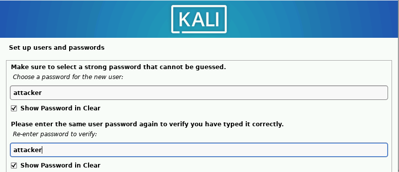

8. Choose your time zone ➔ “Continue”.
9. Select “Guided – use entire disk” ➔ “Continue.” Keep all defaults selected.

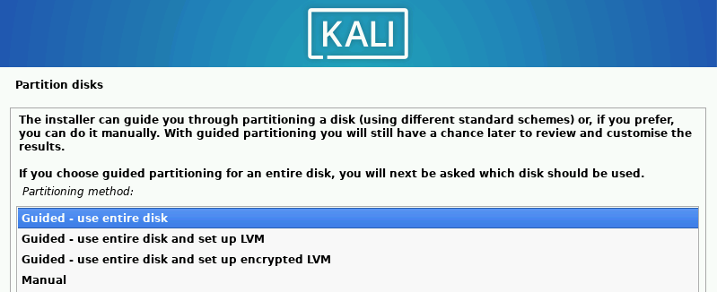
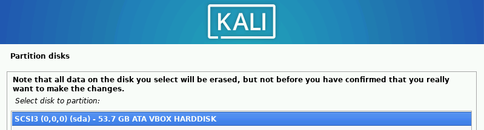

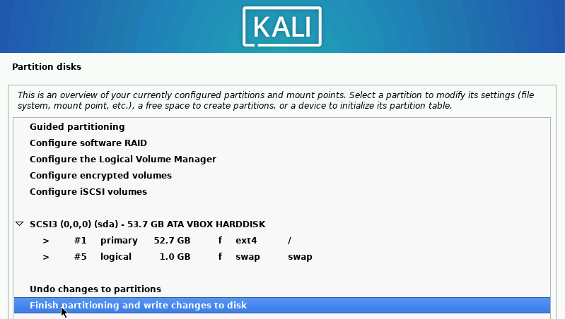

10. Change “Write the changes to disks?” to “Yes” ➔ “Continue.”

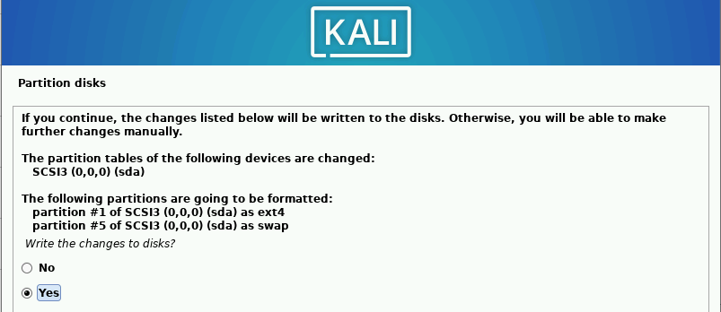

11. Keep defaults ➔ “Continue”. Wait for the software to install.

12. Install the GRUB Loader ➔ “Continue”.

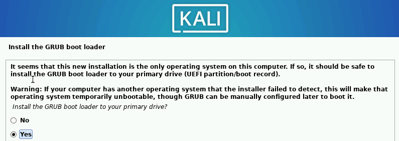
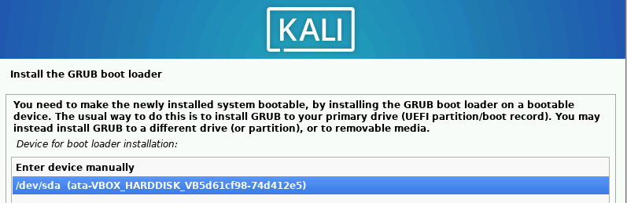

13. Let the system reboot ➔ “Continue”.

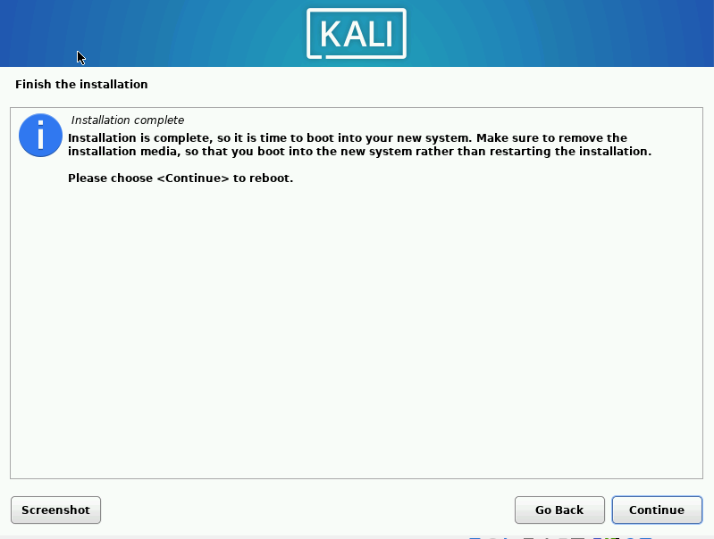

14. Login under the `attacker` account.

✅ Success!

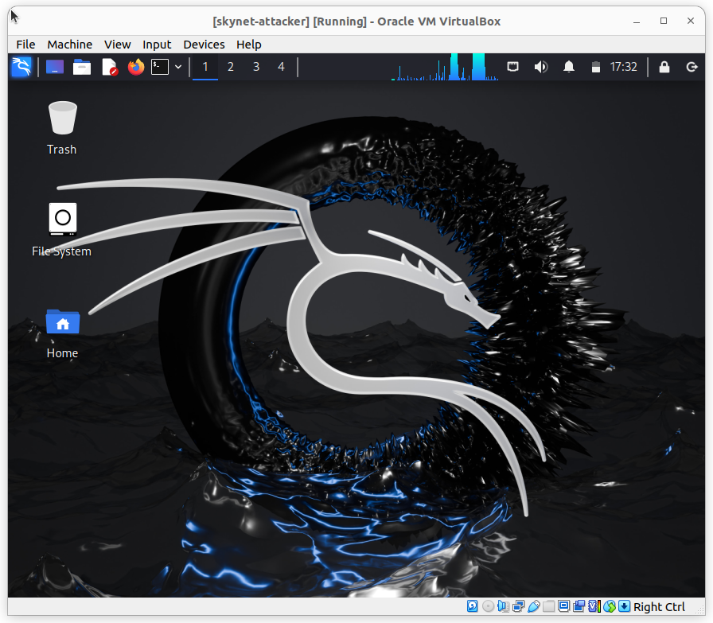

📷 **Take Snapshot!**

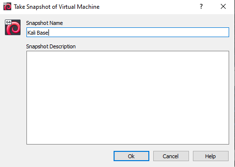

## Optional: Disable Default Logoff (Timeout After 5 Minutes)

1. Go to the Menu Bar ➔ “Power Manager”.
2. Navigate to “Display” tab ➔ Drag Toggle to the left.
