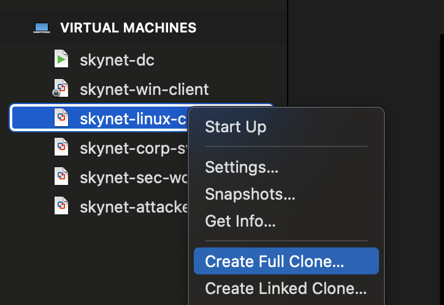
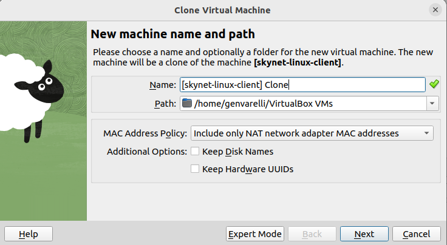
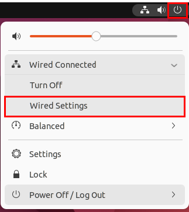
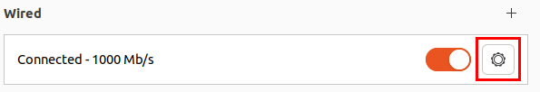

# Ubuntu Desktop 22.04 Setup - Corporate Server 

## 📝 Prerequisites

- **VirtualBox** or **VMware Workstation Pro** installed.
- `skynet-linux-client` VM has already been configured.
- **Windows Server 2025** is running with **Active Directory Domain Services (AD DS)** enabled.

---

## 🏢 Corporate Server (`skynet-corp-svr`) Overview

## 🧭 Purpose

In enterprise environments, **dedicated servers** are used for backend services that support user and application operations. These servers may be deployed **on-premises** or in the **cloud**, depending on business scale and infrastructure.

Examples of common dedicated servers in business environments:

- **Licensing Server** – Issues and manages software licenses for workstations.
- **Internal File Server** – Shares files internally (e.g., via SharePoint or cloud alternatives like Microsoft 365).
- **Database Server** – Stores and retrieves structured information.
- **VPN Server** – Enables secure remote access to the internal network.
- **Jumpbox (Bastion Host)** – Acts as a secure entry point into isolated or protected environments.

---

## 🎯 Our Goal

We'll provision a dedicated server named `skynet-corp-svr`.

This server will function as a **Jumpbox**, acting as the **central gateway** to access internal services such as:
- **FTP**
- **DNS**
- **Email**

Without access to this Jumpbox, these services will be **unreachable**. This setup is **intentional**, designed to reduce the attack surface and enforce strict access control.

> 📌 Note: These internal services will run in **containers**, not separate VMs, to conserve resources.

---

## 📦 Why Containers?

Containers are lightweight, isolated environments that package applications with their dependencies. They run from Docker images and share the host OS kernel (Ubuntu 22.04 in our case).

### Key Concepts

- **Docker** – A platform for developing, shipping, and running applications in containers.
- **Docker Engine** – The background service that powers containerization.

Think of a **Docker Image** as a blueprint defining what software and dependencies a container should run.

---

## 🛡️ Security Implications

Running a dedicated server, especially a **Jumpbox**, introduces certain risks:

### Potential Risks

- **Single Point of Failure**  
  If compromised, the Jumpbox provides access to the entire internal network.

- **Lateral Movement**  
  Weak segmentation or insufficient endpoint protections can allow attackers to pivot into other systems.

- **Lack of Monitoring**  
  Without logging or auditing, malicious actions (e.g., file transfers or commands) may go unnoticed.

> 💡 Best Practice: Jumpboxes should be closely monitored and isolated, with hardened access controls and logging enabled.

---

## Join Active Directory & Install Docker

### Clone VM

We'll use an existing VM (`skynet-linux-client`) as the base:

1. Clone the `skynet-linux-client` VM.

2. Rename the clone to: `skynet-corp-svr`.

This saves time and maintains consistency across our infrastructure.

## 🖥️ Clone VM and Start

- Wait for the VM to fully clone.
- Power on the VM.

## 🌐 Change IP Address

1. Go to **Top Right ➔ Wired Settings**.



2. Navigate to **IPv4** settings.



3. Change IP address from `10.0.0.101` to `10.0.0.8`.
   - Refer to the “Project Overview” guide for full IP details.
4. Leave the remaining settings as default.

## 🖋️ Change Hostname

```bash
sudo hostnamectl set-hostname corp-svr
```

## 👤 Create New User Account

1. Add a new user:

```bash
sudo adduser skynet-admin
```

- Set password to `@password123!`
- Leave personal details blank

2. Add user to sudo group:

```bash
sudo usermod -aG sudo skynet-admin
```

3. Log out of the current user (`janed`).
4. Log in as `skynet-admin` using password `@password123!`.

## 🏢 Join Ubuntu Server to Active Directory

> This VM was cloned from the Linux client and already has necessary AD packages.

1. Test connectivity to Domain Controller:

```bash
ping corp.skynet-dc.com
```

2. Join domain:

```bash
sudo net ads join -U Administrator
```

- Use password: `@Deeboodah1!`

3. Verify AD join in Windows Server:
   - Open **Active Directory Users and Computers** ➔ **Computers**

## 🔐 Log Into AD from Ubuntu

```bash
sudo login
```

- Username: `CORP+Administrator`
- Password: `@Deeboodah1!`

Check you're logged in as `CORP+administrator@corp-svr`.

To logout:

```bash
logout
```

To login again:

```bash
sudo login
```

## 🐳 Install Docker Engine

1. Visit: [Docker Ubuntu Install Guide](https://docs.docker.com/engine/install/ubuntu/)
2. Follow the two command blocks listed for installing Docker.

If prompted, enter `Y` to continue.

### ✅ Test Docker

```bash
docker pull hello-world
docker run hello-world
```

📷 **Take a Snapshot!**


