# Ubuntu Server 25.04 Setup - Security Server

## Prerequisites

- VM with Ubuntu 22.04 ISO downloaded and attached.
- Windows Server 2022 with AD Directory Services (ADDS) configured and running.

## Security Server Overview

A dedicated security server ensures performance, security, and scalability of monitoring tools.

**Why not just use `skynet-corp-svr`?**

- **Performance Isolation**: Keeps resource-heavy tools from affecting shared workloads.
- **Enhanced Security**: Minimises the attack surface by isolating sensitive data.
- **Centralized Management**: Easier to manage logs, alerts, and responses from one location.

We’ll use various tools to simulate monitoring and defense.

## Setup Security Server

1. **Clone `skynet-linux-client` VM (must be powered off).**
2. Right-click ➝ Clone.
3. Name it `skynet-sec-box` ➝ Next.
4. Select **Full Clone** and **Everything (with snapshots)**.
5. Wait for the clone to complete and power on the VM.

## Change Hostname and Create User

1. Open Terminal.
2. Edit hostname:

   ```bash
   sudo nano /etc/hostname
   ```

   Replace `linux-client` with:

   ```text
   sec-box
   ```
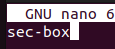

   Save and exit Nano (CTRL + X ➝ Y ➝ Enter).

3. Reboot:

   ```bash
   reboot
   ```


4. Open a new Terminal and add a user:

   ```bash
   sudo adduser sec-user
   sudo usermod -aG sudo sec-user
   ```

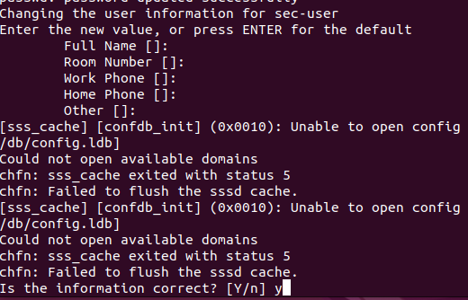

5. Switch user and confirm sudo:

   ```bash
   su sec-user
   sudo whoami
   ```
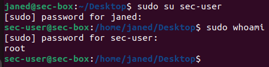

## Connect to Active Directory

1. Ensure the system can reach AD:

   ```bash
   ping 10.0.0.5
   ping corp.skynet-dc.com
   ```
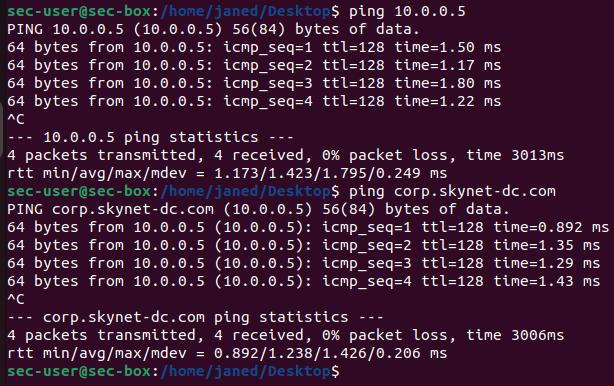

2. Join the domain:

   ```bash
   sudo net ads join -U Administrator
   ```
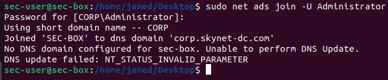

## Create sec-user in AD

1. On the Domain Controller (skynet-dc):
   - Open **Active Directory Users and Computers**.

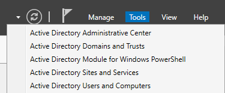
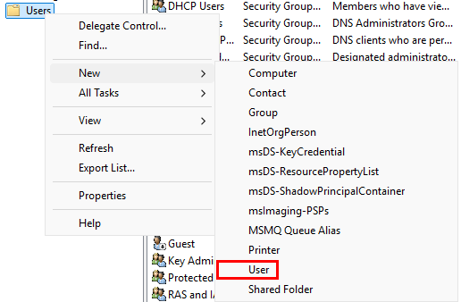

    - Right-click `Users` ➝ New ➝ User.
   - Username: `secuser`
   - Domain: `corp.skynet-dc.com`
   - Password: `@password123!`

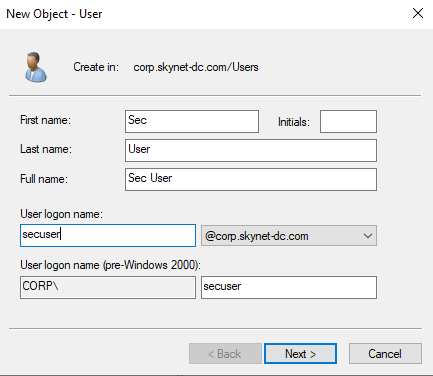
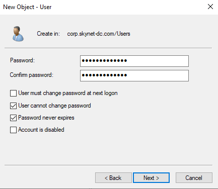

## Verify AD Integration

1. Restart winbind and check users:

   ```bash
   sudo systemctl restart winbind
   wbinfo -u
   ```

2. Login as AD user:

   ```bash
   sudo login
   ```

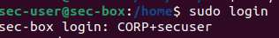
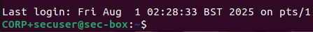

You should now be successfully logged in to `skynet-sec-box` with AD integration.

📸 **Take a snapshot now!**


