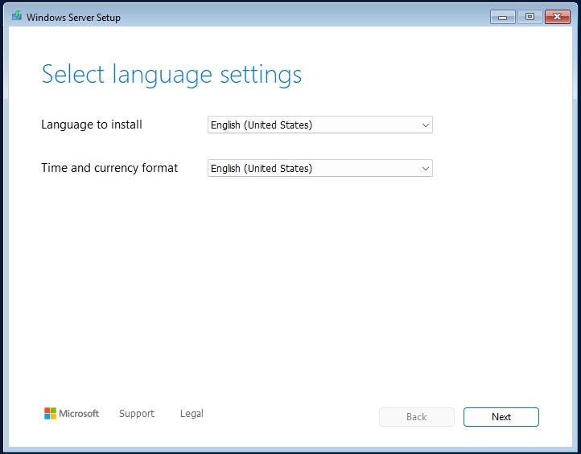
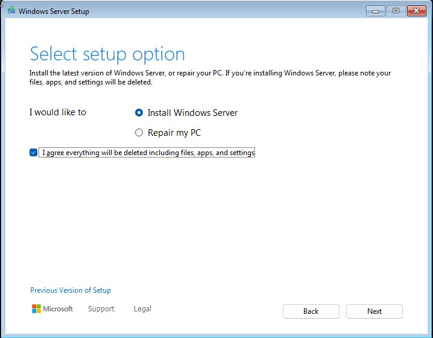
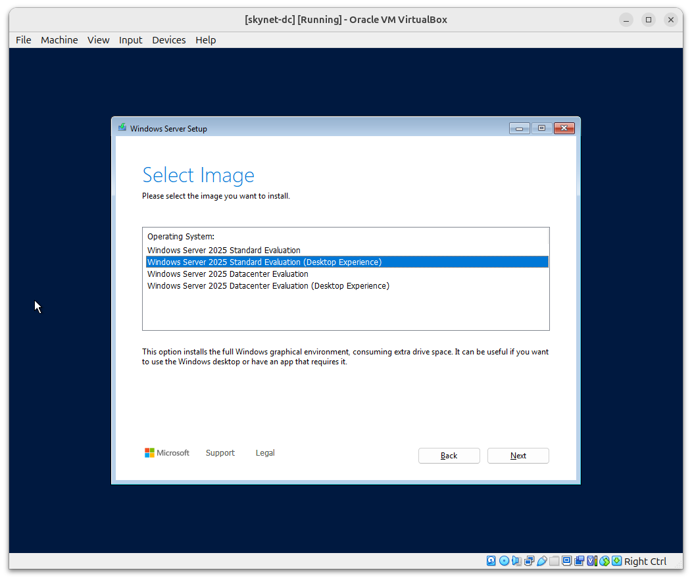
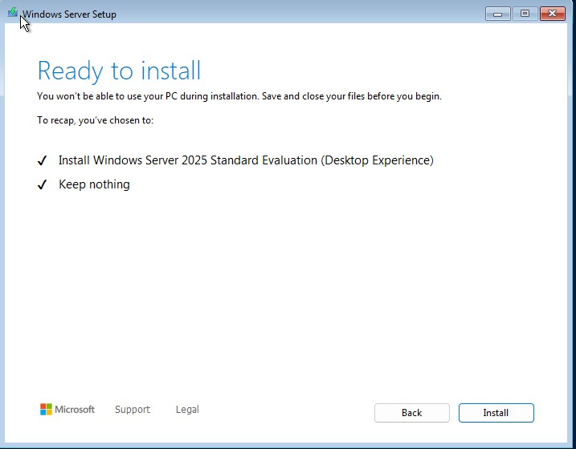
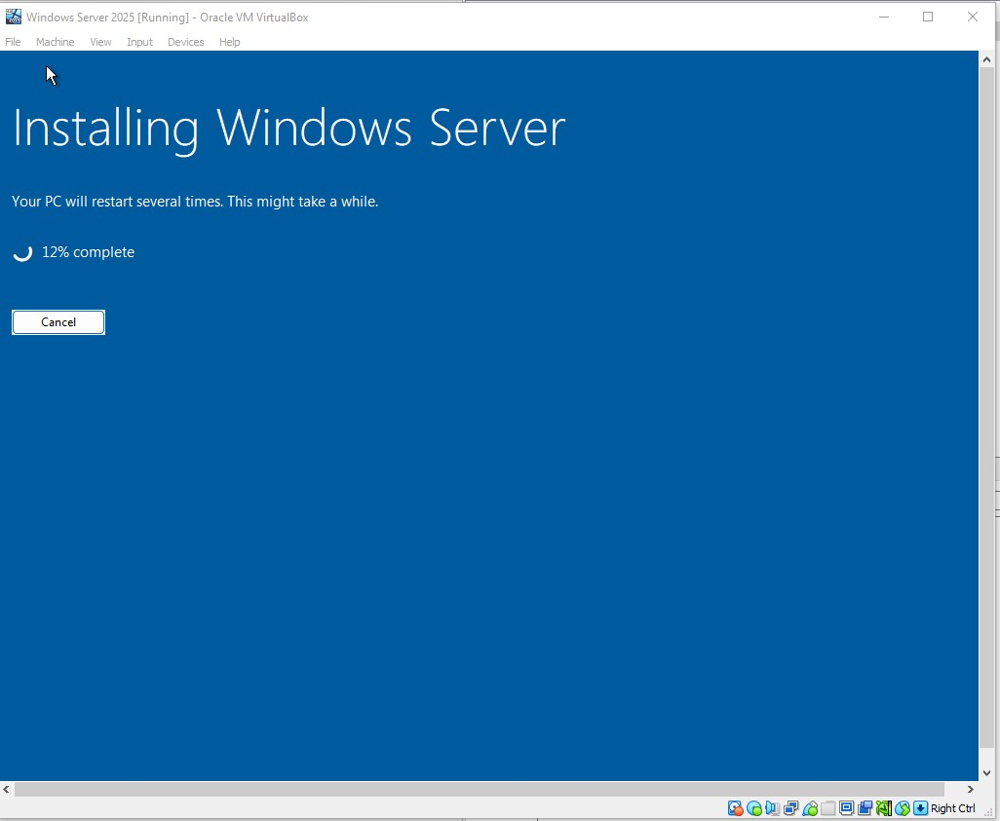

# AD Server - Windows Server 2025 Setup

## What is Active Directory?

**Active Directory (AD)** is Microsoft’s directory service used to manage users, devices, and resources on a network. It acts as a **centralised database** to:

- **Authenticate** users (verify identity)
- **Authorise** access (grant or deny permissions)
- **Manage** network resources (users, devices, policies)

---

## Why Use Active Directory?

AD is essential in enterprise environments because it:

- 🔧 **Centralises management** of users, devices, and permissions  
- 📈 **Scales easily** — from small businesses to multinational organisations  
- 🔐 **Secures authentication & authorisation** using protocols like **Kerberos** and **LDAP**  
- 🛠️ **Applies policies** through **Group Policy Objects (GPOs)** for security and software control  
- 🔗 **Integrates** with tools like **Microsoft Exchange**, **Azure AD**, and other enterprise services

---

## Core Concepts in Active Directory

| Concept | Description |
|--------|-------------|
| **Domain** | A logical group of users/devices with shared policies and authentication.  🧪 *We will use:* `corp.project-x-dc.com` |
| **Domain Controller (DC)** | A server that stores the AD database and handles logins and permissions |
| **Organisational Units (OUs)** | Folders within a domain used to logically organise users and devices (e.g., HR, IT, Finance) |
| **Objects** | Everything in AD — users, computers, printers, groups, etc. |
| **Groups** | Used to manage access: - **Security Groups**: For permissions - **Distribution Groups**: For email |
| **Forest & Trees** | **Forest** = Top-level container for domains **Tree** = Linked domains in a hierarchy |
| **Global Catalogue (GC)** | Speeds up searches by storing information about all AD objects in the forest |
| **Trust Relationships** | Allow users in one domain to access resources in another domain |

---

## Security Considerations

Since AD controls access to critical systems, it’s a frequent target for attackers.

### 🔒 Common Threats:

- **Credential Theft** – e.g., *Pass-the-Hash*, *Kerberoasting*
- **Privilege Escalation** – exploiting misconfigured permissions
- **Lateral Movement** – using AD to move through the network

---

## Hybrid vs On-Premises AD

Many organisations use **hybrid identity setups** (on-premises + cloud) with **Microsoft Entra ID** (formerly Azure Active Directory).

🔧 For this project, we’ll use a **fully on-premises AD setup**:
- Full control over setup and configuration  
- No cloud costs  
- Ideal for isolated lab environments

> Object names and some settings may vary slightly from cloud-based AD, but the **core concepts remain the same**.

---
## Windows Server 2025 Setup

Select “Next” ➔ “Install Windows 11” ➔ Check the box ➔ “Next”.

Selected the **Desktop Experience** version for GUI access.

   

Accept Microsoft’s End User License Agreement (EULA) ➔ “Next”.

Select “Disk 0 Unallocated Space” ➔ “Create Partition”. Use the default “Size in MB” setting ➔ “Apply".

Wait for two or three partitions to show up.

> 💡 **Note**: Why is this done?: Partitions are logically separated containers used to organize and separate data. We create a couple partitions to separate these spaces out.

Select Disk 0 **Partition 2** (always choose the largest available partition).

   

Select “Install”. 

Wait for Windows Server 2025 to fully install. The VM should restart. 

---

A login prompt will appear after restarting...

Set a password for the default Administrator account. Password is Mr.Robot1

> 💡 **Note**: Refer to the “Project Overview” guide for more information on default usernames and passwords.

The login screen will appear.

If on VirtualBox, navigate to the top of VirtualBox, go to **“Input” ➔ “Keyboard” ➔ “Insert Ctrl-Alt-Del”** to open the login prompt. 

2. Confirmed **Server Manager** loaded successfully.
3. Disabled screen timeout:
   - Went to **Settings > Power & Battery > Screen Timeout** → set to **Never**

4. Disabled **Ctrl+Alt+Del** login requirement:
   - Navigated to `Computer Configuration > Windows Settings > Security Settings > Local Policies > Security Options`
   - Enabled **"Interactive login: Do not require Ctrl+Alt+Del"**

   

5. Enabled full-screen, clipboard sharing, and drag-and-drop:
   - Inserted **Guest Additions CD Image** via VirtualBox
   - Ran the installer inside the VM
   - Rebooted and enabled features under **Settings > General > Advanced**

   

---

## Server Configuration

### Step 1: Assign Static IP Address

1. Opened **Control Panel > Network and Sharing Centre > Change adapter settings**
2. Right-clicked **Ethernet** → selected **Properties**
3. Configured IPv4 with:
   - **IP**: `10.0.0.5`
   - **Subnet Mask**: `255.255.255.0`
   - **Default Gateway**: `10.0.0.1`

   

---

### Step 2: Installing Roles and Features

1. Opened **Server Manager**
2. Clicked **Add Roles and Features**
3. Selected **Role-based or feature-based installation**
4. Targeted the local server (`10.0.0.5`)
5. Installed the following roles:
   - **Active Directory Domain Services (AD DS)**
   - **DHCP Server**
   - **DNS Server**

   
   
   

6. Clicked **Install** and waited for completion.

   

---

### Step 3: Promoting the Server to a Domain Controller

1. Opened **Server Manager > AD DS** → clicked **More...**
   

2. Clicked **Promote this server to a domain controller**
   

3. Chose **Add a new forest** → entered domain: `corp.skynet-dc.com`
   

4. Left default domain controller options → set **DSRM password**
   

5. Left **NetBIOS name** as `CORP` → clicked through to **Install**
   

6. Server restarted automatically after installation.

---

## Verifying Domain and DNS Configuration

### Confirming Domain Setup

After restart, the login screen displayed `CORP\Administrator`, confirming that Active Directory and the domain were properly set up.

---

### Configuring DNS for Internet Access

1. Opened **Server Manager > DNS**
   

2. Opened **DNS Manager**
   

3. Right-clicked the server → **Properties**
   

4. Went to the **Forwarders** tab → clicked **Edit**
   

5. Added Google DNS: `8.8.8.8` → clicked **OK**, then **Apply**
   

---

### Testing DNS and Internet Access

- Opened **PowerShell**
- Ran: `ping google.com` → successful replies
  
- Ran: `nslookup google.com` → resolved IP address
  

---

## Setting Up DHCP

Although most devices will use static IPs, I configured DHCP to support dynamic addressing when needed.

### Creating the Scope

1. Opened **Server Manager > DHCP**
2. Opened **DHCP Manager**
   

3. Right-clicked **IPv4** → selected **New Scope**
   

4. Named the scope: `skynet-scope`
5. IP Range:
   - **Start**: `10.0.0.100`
   - **End**: `10.0.0.200`
   - **Subnet**: `/24` → `255.255.255.0`
   

6. Skipped exclusions → set **Lease Duration** to **8 days**
7. Chose to configure options immediately

8. Set **Default Gateway**: `10.0.0.1`
   

9. Skipped DNS/WINS → activated the scope → clicked **Finish**

---

### Finalising DHCP Configuration

1. Back in **Server Manager**, clicked **More...** on the DHCP notification
2. Selected **Complete DHCP configuration**
   
   

3. Clicked **Next**, **Commit**, then **Close**
4. Refreshed the screen to verify setup

---

## Creating Active Directory User Accounts

Next, I started creating user accounts in Active Directory.

AD user accounts allow individual users to sign in to their assigned workstations. These accounts represent user identities and can also be used to log in to multiple machines across the domain if permitted.

> These accounts are essential for managing access, applying group policies, and assigning roles or permissions across the network.

With the domain controller fully configured, I created user accounts that will later be used to log in from client machines.

### Step 1: Open Active Directory Users and Computers

1. In **Server Manager**, clicked the **Tools** dropdown (top-right corner).
2. Selected **Active Directory Users and Computers**.

> 📸 

3. In the left-hand pane, expanded the domain tree.
4. Clicked on the **Users** container to manage accounts.

---

### Step 2: Create User – John Doe

1. Right-clicked the **Users** folder → selected **New > User**.
📸 
2. Filled in the following:
   - **First Name**: John
   - **Last Name**: Doe
   - **User logon name**: `john.doe`

> This user will be linked to the `-win-client` VM.
📸 

3. Adjusted password options:
   - **Deselected**: "User must change password at next logon"
   - **Selected**: "User cannot change password"

> These settings help maintain consistency and prevent sync issues during testing.

4. Entered the predefined password from the project overview.
5. Clicked **Next**, then **Finish** to complete the user creation.

---

### Step 3: Create User – Jane Doe

1. Repeated the same process to create a second user:
   - **First Name**: Jane
   - **Last Name**: Doe
   - **User logon name**: `jane.doe`
   - Used the same password settings for consistency.

> 📸 

---

## Creating a VM Snapshot (Baseline)

To preserve this configuration state, I created a snapshot of the domain controller VM in **VirtualBox**:

1. In the **VirtualBox** menu, selected **Machine > Take Snapshot**.
2. Named the snapshot: `base` — this marks the **baseline configuration** of the domain controller.

> 📸 

---

This snapshot acts as a restore point and will help recover progress if any future misconfigurations occur.

## Status

At this point, the **Windows Server VM** is fully configured as a **domain controller** with **AD DS**, **DNS**, and **DHCP** services running ready to manage users and network devices in the Skynet corporate environment.
