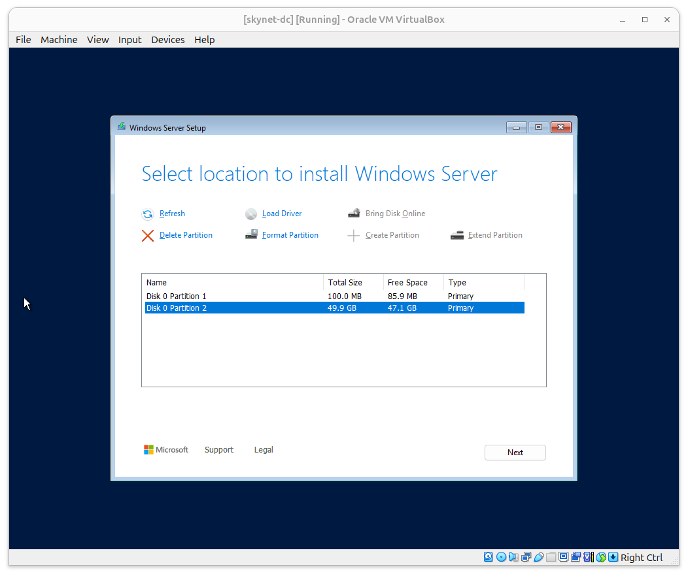
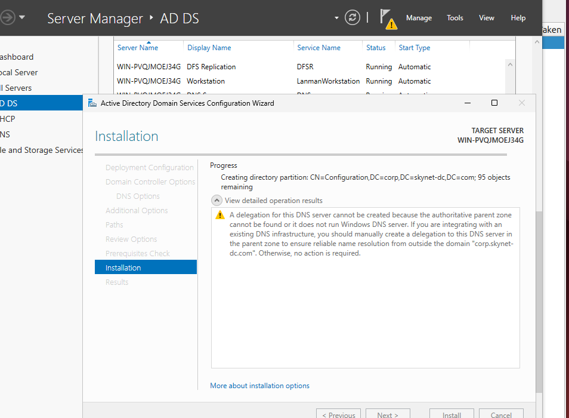
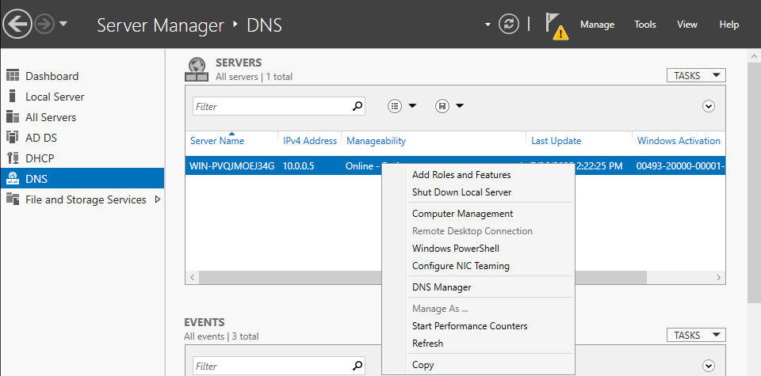
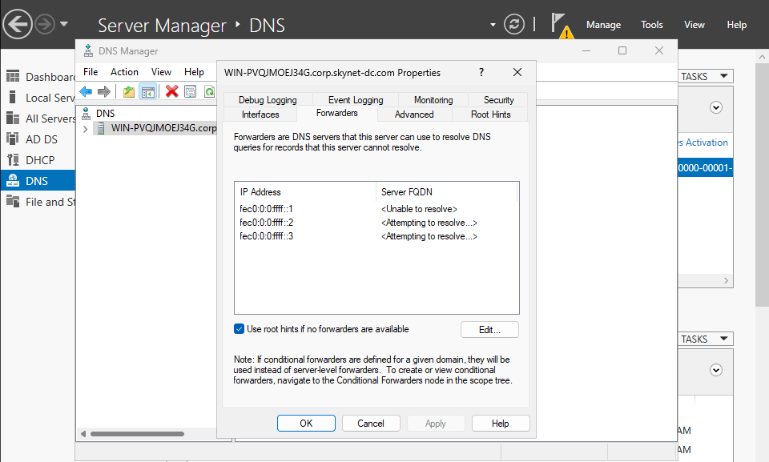
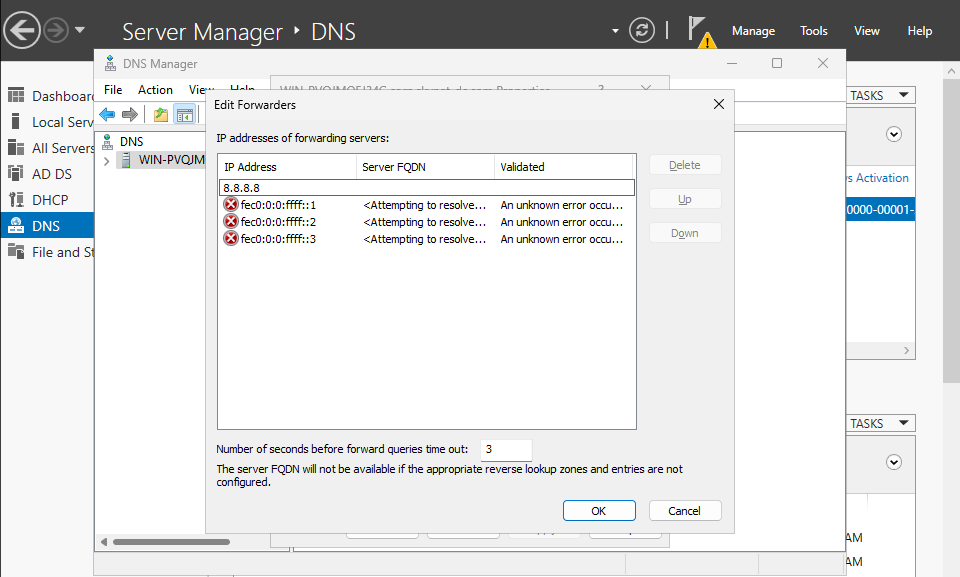
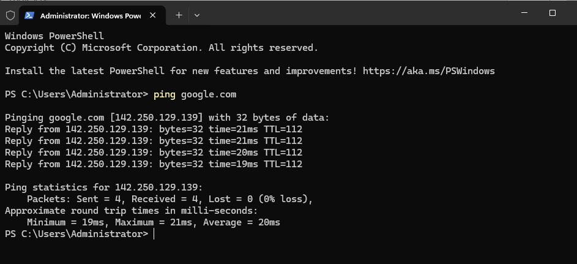
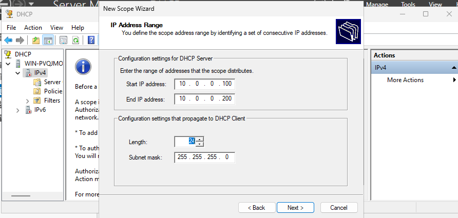
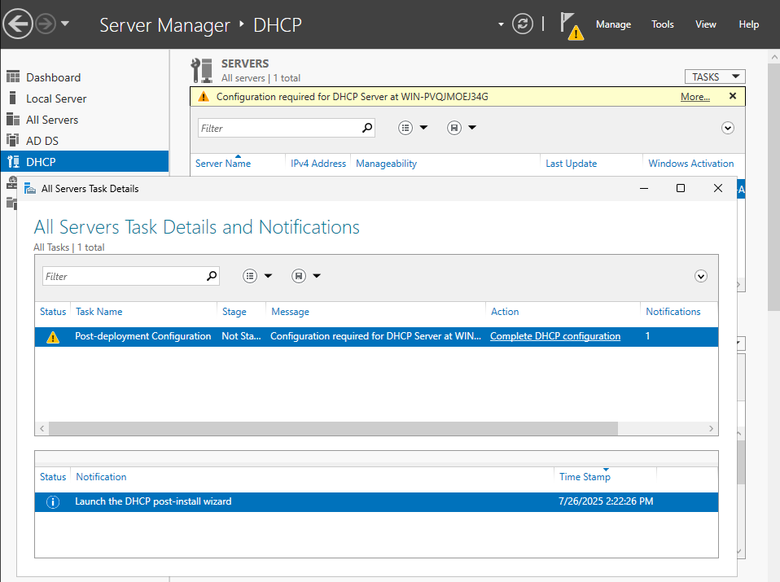
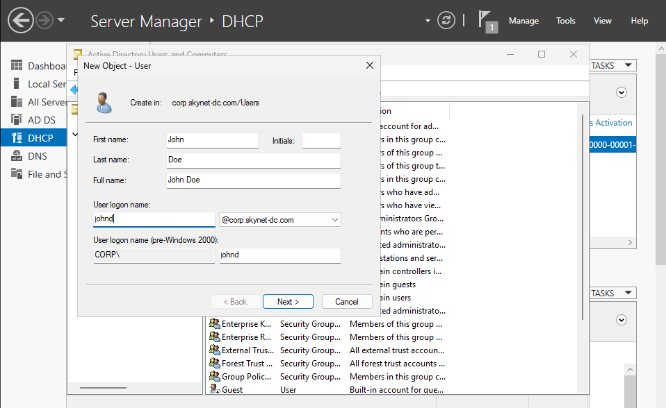

# Skynet Network Setup (Corp Environment)

## Directory Services Server Setup (Windows Server 2025)

### Step 1: Creating the VM in VirtualBox

1. Opened **VirtualBox** and clicked **New** to create a VM named `skynet-dc`.
2. Selected a folder to store VM files.
3. Chose **Windows Server 2025 (64-bit)** as the OS type.
4. Selected the `Windows Server 2025.iso` as the installation ISO.

   

5. Allocated **4096 MB RAM** and **2 CPUs** based on project specs.

   

6. Created a **dynamically allocated** virtual hard disk (unchecked “Pre-allocate”) with **50 GB** space.

   

7. Configured **network adapters**:
   - Adapter 1: **NAT** (for internet access)
   - Adapter 2: **Internal Network**, named `skynet-network`

   

8. Clicked **Finish**, then started the VM and installed Windows Server using the ISO.

---

### Step 2: Installing Windows Server (GUI)

1. Started the VM and began installation.
2. Accepted the license terms.
3. Selected the **Desktop Experience** version for GUI access.

   

4. Installed on **Partition 2** (the largest available partition).

   

5. Server rebooted several times and completed installation with the GUI.

---

### Step 3: Creating the Administrator Account

1. Set up the default **Administrator** account.
2. Used a strong password (as per project guidelines).
3. Clicked **Next** to finish.

---

### Step 4: Post-Installation Configuration

1. Logged into the server using `Ctrl + Alt + Del` via VirtualBox menu.
2. Confirmed **Server Manager** loaded successfully.
3. Disabled screen timeout:
   - Went to **Settings > Power & Battery > Screen Timeout** → set to **Never**

4. Disabled **Ctrl+Alt+Del** login requirement:
   - Navigated to `Computer Configuration > Windows Settings > Security Settings > Local Policies > Security Options`
   - Enabled **"Interactive login: Do not require Ctrl+Alt+Del"**

   

5. Enabled full-screen, clipboard sharing, and drag-and-drop:
   - Inserted **Guest Additions CD Image** via VirtualBox
   - Ran the installer inside the VM
   - Rebooted and enabled features under **Settings > General > Advanced**

   

---

## Server Configuration

### Step 1: Assign Static IP Address

1. Opened **Control Panel > Network and Sharing Centre > Change adapter settings**
2. Right-clicked **Ethernet** → selected **Properties**
3. Configured IPv4 with:
   - **IP**: `10.0.0.5`
   - **Subnet Mask**: `255.255.255.0`
   - **Default Gateway**: `10.0.0.1`

   

---

### Step 2: Installing Roles and Features

1. Opened **Server Manager**
2. Clicked **Add Roles and Features**
3. Selected **Role-based or feature-based installation**
4. Targeted the local server (`10.0.0.5`)
5. Installed the following roles:
   - **Active Directory Domain Services (AD DS)**
   - **DHCP Server**
   - **DNS Server**

   
   
   

6. Clicked **Install** and waited for completion.

   

---

### Step 3: Promoting the Server to a Domain Controller

1. Opened **Server Manager > AD DS** → clicked **More...**
   

2. Clicked **Promote this server to a domain controller**
   

3. Chose **Add a new forest** → entered domain: `corp.skynet-dc.com`
   

4. Left default domain controller options → set **DSRM password**
   

5. Left **NetBIOS name** as `CORP` → clicked through to **Install**
   

6. Server restarted automatically after installation.

---

## Verifying Domain and DNS Configuration

### Confirming Domain Setup

After restart, the login screen displayed `CORP\Administrator`, confirming that Active Directory and the domain were properly set up.

---

### Configuring DNS for Internet Access

1. Opened **Server Manager > DNS**
   

2. Opened **DNS Manager**
   

3. Right-clicked the server → **Properties**
   

4. Went to the **Forwarders** tab → clicked **Edit**
   

5. Added Google DNS: `8.8.8.8` → clicked **OK**, then **Apply**
   

---

### Testing DNS and Internet Access

- Opened **PowerShell**
- Ran: `ping google.com` → successful replies
  
- Ran: `nslookup google.com` → resolved IP address
  

---

## Setting Up DHCP

Although most devices will use static IPs, I configured DHCP to support dynamic addressing when needed.

### Creating the Scope

1. Opened **Server Manager > DHCP**
2. Opened **DHCP Manager**
   

3. Right-clicked **IPv4** → selected **New Scope**
   

4. Named the scope: `skynet-scope`
5. IP Range:
   - **Start**: `10.0.0.100`
   - **End**: `10.0.0.200`
   - **Subnet**: `/24` → `255.255.255.0`
   

6. Skipped exclusions → set **Lease Duration** to **8 days**
7. Chose to configure options immediately

8. Set **Default Gateway**: `10.0.0.1`
   

9. Skipped DNS/WINS → activated the scope → clicked **Finish**

---

### Finalising DHCP Configuration

1. Back in **Server Manager**, clicked **More...** on the DHCP notification
2. Selected **Complete DHCP configuration**
   
   

3. Clicked **Next**, **Commit**, then **Close**
4. Refreshed the screen to verify setup

---

## Creating Active Directory User Accounts

Next, I started creating user accounts in Active Directory.

AD user accounts allow individual users to sign in to their assigned workstations. These accounts represent user identities and can also be used to log in to multiple machines across the domain if permitted.

> These accounts are essential for managing access, applying group policies, and assigning roles or permissions across the network.

With the domain controller fully configured, I created user accounts that will later be used to log in from client machines.

### Step 1: Open Active Directory Users and Computers

1. In **Server Manager**, clicked the **Tools** dropdown (top-right corner).
2. Selected **Active Directory Users and Computers**.

> 📸 

3. In the left-hand pane, expanded the domain tree.
4. Clicked on the **Users** container to manage accounts.

---

### Step 2: Create User – John Doe

1. Right-clicked the **Users** folder → selected **New > User**.
📸 
2. Filled in the following:
   - **First Name**: John
   - **Last Name**: Doe
   - **User logon name**: `john.doe`

> This user will be linked to the `-win-client` VM.
📸 

3. Adjusted password options:
   - **Deselected**: "User must change password at next logon"
   - **Selected**: "User cannot change password"

> These settings help maintain consistency and prevent sync issues during testing.

4. Entered the predefined password from the project overview.
5. Clicked **Next**, then **Finish** to complete the user creation.

---

### Step 3: Create User – Jane Doe

1. Repeated the same process to create a second user:
   - **First Name**: Jane
   - **Last Name**: Doe
   - **User logon name**: `jane.doe`
   - Used the same password settings for consistency.

> 📸 

---

## Creating a VM Snapshot (Baseline)

To preserve this configuration state, I created a snapshot of the domain controller VM in **VirtualBox**:

1. In the **VirtualBox** menu, selected **Machine > Take Snapshot**.
2. Named the snapshot: `base` — this marks the **baseline configuration** of the domain controller.

> 📸 

---

This snapshot acts as a restore point and will help recover progress if any future misconfigurations occur.

## Status

At this point, the **Windows Server VM** is fully configured as a **domain controller** with **AD DS**, **DNS**, and **DHCP** services running — ready to manage users and network devices in the Skynet corporate environment.
