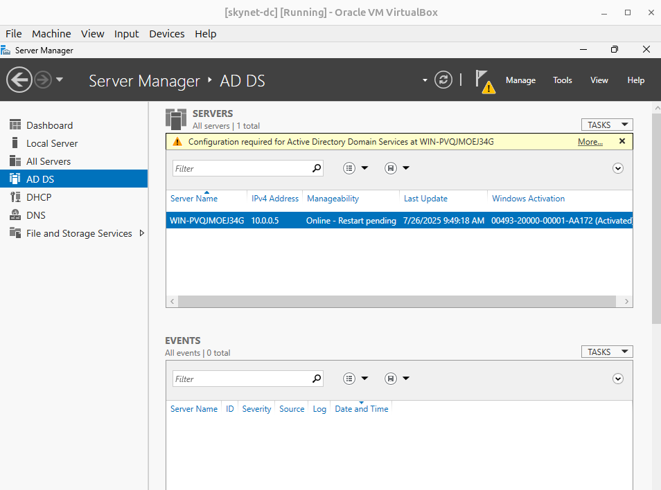
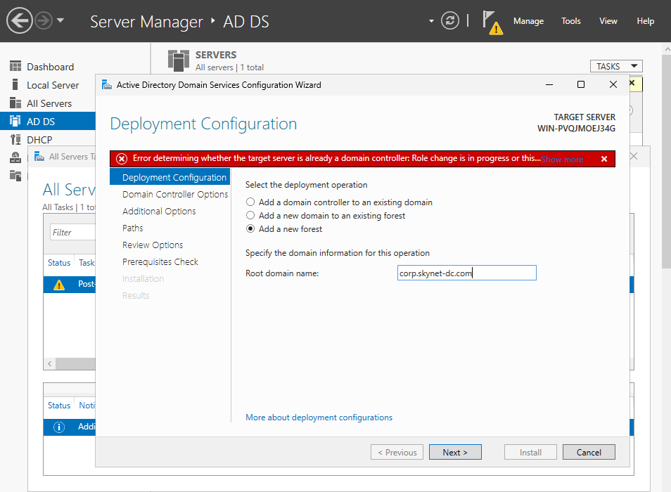

# Skynet Network Setup (Corp Environment)

## Building the Directory Services Server (Windows Server 2025)

### Step 1: Setting Up Active Directory in VirtualBox

To start, I needed to set up a virtual machine (VM) in **VirtualBox**. Here’s how I did it:

1. First, I opened **VirtualBox** and clicked **"New"** to create a new VM.
2. I named the VM exactly as specified (e.g., `skynet-dc`), so it matched the project requirements.
3. Next, I selected a folder to store the VM files.
4. VirtualBox automatically detected the **OS Type**. If it hadn’t, I would have manually chosen **Windows Server 2025 (64-bit)**.
5. I then selected the **ISO Image** for the operating system I’d downloaded (e.g., `Windows Server 2025.iso`).
   
   
   
6. For the **Base Memory & Processors**, I followed the specifications given in the project table. For example, the `skynet-dc` VM needed 4096 MB of RAM and 2 CPUs.

   

7. When configuring the **Hard Disk**, I chose "Create a virtual hard disk now" and ensured that the **"Pre-allocate Full Size"** option was unchecked (this allows for dynamic allocation). For disk size, I used the minimum storage requirements, which was 50 GB for `skynet-dc`.

   

8. For **Network Setup**, before starting the VM, I went to **Settings > Network** and:
   - Set **Adapter 1** to **"NAT"** for internet access.
   - Added extra adapters to allow VM-to-VM communication by choosing **"Internal Network"** and naming it `skynet-network` (to keep it consistent).

   

9. After all that, I clicked **Finish** to complete the VM setup.
10. To install the operating system, I selected the VM and clicked **"Start"**. Then I followed the on-screen instructions, using the mounted ISO to install Windows Server.

---

### Step 2: Installing Windows Server (Active Directory Control Server)

Once the VM was created, I started the installation process:

1. I started the VM and clicked **Next** to begin the installation.
2. I accepted the **Microsoft Licensing Terms** and clicked **Next** to proceed.
3. I chose the **Desktop Experience** option, which installs the graphical user interface (GUI) for easier management.

   

4. I selected **Partition 2**, the largest partition, and clicked **Next** > **Install** to begin the installation.

   

5. The server rebooted several times during the installation process, and once complete, Windows Server was ready with the GUI installed.

---

### Step 3: Setting Up the Administrator Account

During installation, I was prompted to set up the **Administrator account**. Here’s what I did:

1. I created the **Administrator** username (using the default credentials as noted in the project overview).
2. I entered a secure **password** (mix of letters, numbers, and special characters as required).
3. I clicked **Next** to finish the setup.

**Note**: For consistency, I used the default credentials listed in the project overview.

---

### Step 4: Finalising Settings for the Windows Server VM

Once the server VM was up and running, I made a few adjustments to optimise the setup:

1. I **logged in to the VM**:
   - In the VM tab, I clicked the **input bar** and selected **Keyboard > Ctrl+Alt+Del** to ensure I wasn’t locked out.
   - Then, I entered the password I had set earlier.

2. The **Server Manager** panel appeared, confirming that the system was ready for domain controller configuration.
   
3. To **adjust the screen timeout** (since the default 5-minute timeout was annoying), I:
   - Went to **Settings > Power & Battery > Screen Timeout** and set it to **Never**.

4. I disabled the **Ctrl+Alt+Del** requirement for login, which would be useful since I wasn’t planning to log out frequently:
   - I opened **Local Group Policy Editor** by typing **gpedit.msc** in Windows Search.
   - I navigated to **Computer Configuration > Windows Settings > Security Settings > Local Policies > Security Options**.
   - There, I double-clicked on **"Interactive login: Do not require Ctrl+Alt+Del"**, set it to **Enabled**, clicked **Apply**, and then **OK**.

   

5. To enhance the VM experience with **full screen, shared clipboard, and drag-and-drop**, I enabled **integration features**:
   - In the **VirtualBox menu bar**, I went to **Devices → Insert Guest Additions CD Image**.
   - I ran the installer inside the VM and rebooted.
   - After the reboot, I enabled the **Bidirectional Shared Clipboard** and **Drag and Drop** through **Machine → Settings → General → Advanced**.

   

---

## Directory Services Server Configuration

### Step 1: Apply Static IP Address

To ensure the server’s IP address doesn’t change, I configured a **static IP**:

1. I opened **Control Panel** and navigated to **Network and Sharing Centre** > **Change adapter settings**.
2. I right-clicked on the **Ethernet** adapter and selected **Properties**.
3. I selected **Internet Protocol Version 4 (TCP/IPv4)** and clicked **Properties**.
   - I entered:
     - **IP Address**: `10.0.0.5`
     - **Subnet Mask**: `255.255.255.0`
     - **Default Gateway**: `10.0.0.1`

   

5. This IP setup fits within the **/24 subnet** range, providing up to 254 usable IPs from `10.0.0.1` to `10.0.0.254`.

---

### Step 2: Install Roles and Features

To configure the server as a domain controller, I added the required roles and features:

1. I opened **Server Manager**.
2. I clicked **Add Roles and Features** to begin the installation process.
3. I followed the default wizard configuration and clicked **Next**.

   

4. I selected **Role-based or feature-based installation** and clicked **Next**.
5. In the **Select destination server** section, I chose the server at `10.0.0.5` and clicked **Next**.
6. I selected the **Active Directory Domain Services (AD DS)** role and clicked **Add Features** when prompted.

   

7. I also selected the **DHCP Server** role and clicked **Add Features**.

   

8. Then, I selected the **DNS Server** role and added it in the same way.

   

9. After going through all the screens, I clicked **Install** to complete the process.

   

Once complete, the server was fully set up with **AD DS**, **DHCP**, and **DNS** roles.

---

### Step 3: Promoting the Server to a Domain Controller

Here's how I promoted the server to a domain controller:

1. Opened **Server Manager**, went to **AD DS**, and clicked **"More..."** on the amber notification at the top.

   
   
3. Clicked **"Promote this server to a domain controller"**.

   
5. Selected **"Add a new forest"** and entered `corp.skynet-dc.com` as the domain name.  
   This will act as the main domain for connecting all workstations.
   
   
7. Clicked **Next**. On the **Domain Controller Options** screen, I left the defaults selected.  
   For the **DSRM (Directory Services Restore Mode)** password, I used the same one set earlier for the administrator account.
   
8. Clicked **Next** twice.

9. Left **CORP** as the **NetBIOS** name and clicked **Next**.

10. Continued clicking **Next** until I reached the **Prerequisites Check**.  
   Allowed it to apply settings automatically, then clicked **Install**.
   
11. Once the installation completed, the window closed and the server restarted automatically.

## Verifying Domain Setup and Configuring DNS

After the server restarted, it displayed CORP\Administrator at the login screen — confirming that Active Directory was successfully installed and the domain corp.skynet-dc.com was active. A good sign!

### Setting Up DNS

To give the domain controller internet access, I configured DNS:

1. Opened **Server Manager** → selected **DNS**.

2. Right-clicked the server name → clicked **DNS Manager**.

3. In DNS Manager, expanded the server node on the left.
4. Right-clicked the server again → selected **Properties**.

5. Went to the **Forwarders** tab → clicked **Edit**.

6. Added Google’s public DNS server: 8.8.8.8.

7. Clicked **OK**, then **Apply**, then **OK** again.

### Testing Internet Access

To test internet connectivity:

- Opened **Windows PowerShell**.
- Ran ping google.com — received replies, confirming internet access.
  
- Ran nslookup google.com — successfully resolved domain names to IP addresses.
  
---

## Setting Up DHCP

Next, I configured DHCP to act as a leasing server, although for this lab I’ll mostly be assigning static IPs to workstations.

1. In **Server Manager**, opened **DHCP**.
2. Right-clicked the server name → selected **DHCP Manager**.
   
3. In DHCP Manager, expanded **IPv4** on the left, then right-clicked it and selected **New Scope**.
   
   
### Creating the DHCP Scope

- Named the scope: skynet-scope.
- Set the IP address range:
  - **Start IP**: 10.0.0.100
  - **End IP**: 10.0.0.200
- Subnet mask: /24 → 255.255.255.0
- Clicked **Next**.

Skipped the exclusion range → clicked **Next**.

- Lease duration: set to **8 days** → clicked **Next**.
- Chose **"Yes, I want to configure these options now"** → clicked **Next**.

For internet access, I set the **Default Gateway (Router IP)** to 10.0.0.1.

- Clicked **Next** through the DNS and WINS configuration.
- Selected **"Yes, activate this scope now"** → clicked **Finish**.

---
## Finalising DHCP Configuration

The last step for DHCP was to deploy the configuration:

1. In the **DHCP** tab in **Server Manager**, an amber notification appeared at the top.
2. Clicked **"More..."** → then selected **"Complete DHCP configuration"**.

4. Clicked **Next**, then **Commit**, and finally **Close**.
5. Refreshed the screen to confirm everything was applied.

---

## Creating Active Directory User Accounts

Next, I started creating user accounts in Active Directory.

AD user accounts allow individual users to sign in to their assigned workstations. These accounts represent user identities and can also be used to log in to multiple machines across the domain if permitted.

> These accounts are essential for managing access, applying group policies, and assigning roles or permissions across the network.

Now, the **Windows Server VM** was fully configured as a domain controller with all necessary services installed and ready for use.
