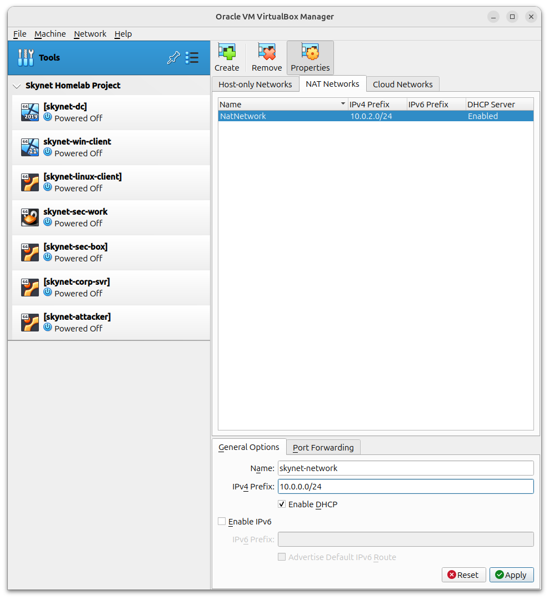

## 🌐 Creating the VirtualBox NAT Network

As part of setting up my project environment, I created a custom **NAT Network** in VirtualBox to enable internal communication between the virtual machines. Below are the steps I followed:

### Steps Taken:

1. **Open VirtualBox**.
2. Navigate to the **Tools** section.
3. Click on the **Network** icon in the top-right corner.
4. In the **Network Manager**, select the **NAT Networks** tab.
5. Click **Create** to add a new NAT network.
6. Rename the new network to `skynet-network`.
7. Set the **IPv4 Prefix** to `10.0.0.0/24`.
8. Enable the **DHCP** option to allow automatic IP assignment.
9. Click **Apply** to save the configuration.

> 📸   
> 📸 

### Outcome:

This process created a NAT network named `skynet-network` with the subnet `10.0.0.0/24`. DHCP is enabled, meaning any virtual machines connected to this network will automatically receive an IP address.

---

## 🔗 Connecting Virtual Machines to the NAT Network

Once the `skynet-network` NAT Network was created, I configured each virtual machine to connect to it. This ensures that all VMs on the project are able to communicate over the same internal network.

### Steps Taken for Each VM:

1. **Open VirtualBox**.
2. Select a virtual machine and click on **Settings**.
3. Go to the **Network** tab.
4. Under **Adapter 1**, ensure the checkbox for **Enable Network Adapter** is checked.
5. In the **Attached to:** dropdown, select **NAT Network**.
6. In the **Name** dropdown, select `skynet-network`.
7. Click **OK** (or **Apply**) to save the changes.

> 📸 

### Outcome:

Each VM is now connected to the `skynet-network` NAT Network. This allows them to communicate with each other using internal IP addresses, which are managed by the VirtualBox DHCP server.

---

This setup ensures that all virtual machines in the project are able to interact seamlessly within the same internal network.
